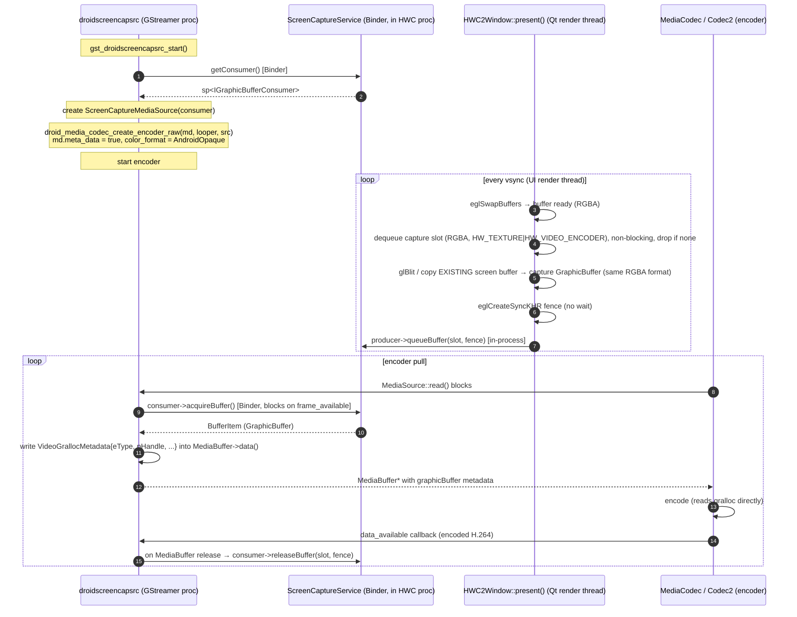

# HWC Display → H.264 Hardware Encoder: Revised Implementation Plan

**Date:** 2026-07-26
**Supersedes:** `wiki/hwc-h264-encoding.md` (2026-07-07)
**Context:** Hardware-accelerated H.264 encoding of the SailfishOS/hybris screen by feeding the HWC compositor's `GraphicBuffer` into the existing Android `MediaCodec` encoder, zero-copy, using the `droid_media_codec_create_encoder_raw` + custom `MediaSource` path.

**Target:** Android 14 (AOSP `services_14_0_0.h`, `MiniSurfaceFlinger` registered as `"SurfaceFlingerAIDL"`). Primary encoder backend: Codec2 (Qualcomm Lahaina-class). Portability fallback: OMX IL.

**Confirmed device facts (from the user):**
- `OMX_COLOR_FormatAndroidOpaque` is accepted by the encoder → encoder does RGBA→YUV internally; no GPU YUV shader needed.
- Codec2 components for AVC/HEVC/HEIC are present. AVC encoder caps (vendor comment): up to 3840×2176@60fps / 4096×2176@48fps, 100 Mbps.
- `libmediandk.so` is present on the device (built from this tree).
- `services_14_0_0.h` exists in `droidmedia/services/`.

---

## 1. What changed vs. the previous plan

| # | Previous plan | Revised plan | Reason |
|---|---|---|---|
| 1 | GPU blit RGBA→NV12 to an NV12 `GraphicBuffer` render target | **Pass the RGBA `GraphicBuffer` through unchanged** using `OMX_COLOR_FormatAndroidOpaque` | GPUs cannot render to YUV FBO color attachments in general; the encoder firmware already does RGB→YUV. Eliminates the shader and one GPU pass. |
| 2 | Used `droidvenc` (GStreamer video encoder element) | Bypass `droidvenc`; call `droid_media_codec_create_encoder_raw` directly with a custom `MediaSource` | `droidvenc` CPU-maps its input (`gstdroidvenc.c:589-591`); the zero-copy path is the `DroidMediaRecorder`+`CameraSource` pattern (`droidmediarecorder.cpp:186`). |
| 3 | Three contradictory BufferQueue ownership sketches | **Single direction:** BufferQueue created in the HWC plugin process; consumer shared to the GStreamer process via Binder | Producer runs on the UI render thread and must never block on cross-process IPC per frame. Only `releaseBuffer` fences cross the Binder boundary. |
| 4 | Blocking `eglClientWaitSyncKHR` in `present()` then also passed a fence fd | Pass the dup'd fence fd; **do not** `eglClientWaitSync` | Blocking defeats the purpose of fences and stalls the UI thread. |
| 5 | Per-frame `glGenTextures`/`eglCreateImageKHR`/destroy in `present()` | Cache one `EGLImageKHR` + texture per BufferQueue slot | Per-frame GL object churn is expensive and risks polluting Qt's GL state. |
| 6 | `ScreenCaptureMediaSource::read` did `new MediaBuffer(item.mGraphicBuffer)` | Fill the encoder-provided `MediaBuffer`'s data area with a `VideoGrallocMetadata` struct; block on `acquireBuffer` until a frame is available | Matches the real metadata-mode contract (`CameraSource::read` reference). |
| 7 | Phase-1 validation pipeline `videotestsrc ! droidvenc ...` | A ~50-line standalone C test harness that calls `droid_media_codec_create_encoder_raw` directly | `droidvenc`'s sink caps require `memory:DroidVideoMetaData, {YV12}` (`gstdroidvenc.c:40-45`); `videotestsrc` cannot negotiate that. |
| 8 | Deferred color-format choice to "Open Question #2" | Resolved: `AndroidOpaque` (primary); QCOM-tiled NV12 (`OMX_QCOM_COLOR_FormatYUV420PackedSemiPlanar32m`) as fallback | Confirmed by the user. |
| 9 | Dropped `captureScreen`-in-MiniSurfaceFlinger approach silently | Document why it was rejected | Prevent future re-proposal. |

---

## 2. Architecture recap (verified against the codebase)

### 2.1 Display pipeline today

```
Qt App → EGL render → GraphicBuffer (HAL_PIXEL_FORMAT_RGBA_8888)
       → HWC2Window::present(buffer)            [hwcomposer_backend_v20.cpp:162-253]
       → hwc2_compat_display_set_client_target  [hwc2_compatibility_layer.cpp:251]
       → hwc2_compat_display_present            [hwc2_compatibility_layer.cpp:236]
       → Display HW
```

`HWC2Window::present(buffer)` is invoked from `HWComposerNativeWindow::queueBuffer()` (`libhybris/.../hwcomposer_window.cpp:249-259`), which EGL calls from `eglSwapBuffers`. So the `buffer` argument to `present()` **is** the just-rendered screen `GraphicBuffer` — no `glReadPixels` or surface re-acquisition is needed.

Window format is `HAL_PIXEL_FORMAT_RGBA_8888` (`hwcomposer_backend_v20.cpp:334`).

### 2.2 MiniSurfaceFlinger today

A stub `BinderService<MiniSurfaceFlinger>` (`services_14_0_0.h:196`) registered as `"SurfaceFlingerAIDL"` on A14. All `captureScreen`/`createDisplay`/`getBuiltInDisplay` overloads return `BAD_VALUE`/`NULL`. It runs **in the same process** as the HWC plugin, launched via `libminisf.so` → `startMiniSurfaceFlinger()` from `initLegacyHwComposerQuirks()` in `hwcomposer_backend.cpp`.

### 2.3 Hardware encoder paths in droidmedia

Two input paths exist in `droidmediacodec.cpp`:

- **`droid_media_codec_queue`** (L933): wraps raw `data`/`size` in an `InputBuffer` → fed to the `Source` MediaSource. CPU-mapped. This is what `droidvenc` uses; not zero-copy.
- **`droid_media_codec_create_encoder_raw`** (L663): takes an arbitrary `sp<MediaSource>` and builds the codec via `DroidMediaCodecBuilder::createCodec` (L380). When `meta->meta_data` is set, the format gets `android._input-metadata-buffer-type` (L447-451) and the codec is created with `FLAG_USE_METADATA_INPUT` (L630-637). The MediaSource's `read()` is then expected to return `MediaBuffer`s whose **data payload** points to a `VideoNativeMetadata`/`VideoGrallocMetadata` struct referencing a `GraphicBuffer`. **This is the zero-copy path and the one this plan uses.**

Reference implementation: `DroidMediaRecorder` (`droidmediarecorder.cpp:157-188`) builds a `CameraSource` as the `MediaSource` and passes it to `droid_media_codec_create_encoder_raw`. `CameraSource::metaDataStoredInVideoBuffers()` decides whether `meta->meta_data` is set (L177).

### 2.4 `DroidMediaBufferQueue` — cross-process transport

`_DroidMediaBufferQueue` (`private.cpp:65-99`) wraps `BufferQueue::createBufferQueue(&m_producer, &m_queue)`. The producer and consumer are Binder interfaces — the underlying `BufferQueueCore` lives in the process that called `createBufferQueue`, and the other side gets a Binder proxy. `GraphicBuffer`s themselves are gralloc-allocated and shared cross-process via `native_handle_t`.

Default format is `HAL_PIXEL_FORMAT_YCBCR_420_888`, default usage `USAGE_HW_TEXTURE` (`private.cpp:93-98`) — both must be overridden for screen capture (RGBA + `HW_VIDEO_ENCODER`).

### 2.5 Key files

| File | Role |
|---|---|
| `qt5-qpa-hwcomposer-plugin/hwcomposer/hwcomposer_backend_v20.cpp` | `HWC2Window::present()` L162-253 — the capture hook point |
| `qt5-qpa-hwcomposer-plugin/hwcomposer/hwcomposer_backend.cpp` | `initLegacyHwComposerQuirks()` — minisf startup |
| `droidmedia/services/services_14_0_0.h` | A14 `MiniSurfaceFlinger` stub (service name `"SurfaceFlingerAIDL"`) |
| `droidmedia/libminisf.cpp` | `startMiniSurfaceFlinger()` L32-44 — where to also instantiate `ScreenCaptureService` |
| `droidmedia/droidmediacodec.cpp` | `droid_media_codec_create_encoder_raw` L663, `createCodec` L380, `flags()` L630 |
| `droidmedia/droidmediacodec.h` | `DroidMediaCodecEncoderMetaData` L77-90 (`meta_data`, `color_format`, `stride`, `slice_height`) |
| `droidmedia/droidmediarecorder.cpp` | Reference for `CameraSource` → `create_encoder_raw` |
| `droidmedia/private.cpp` / `private.h` | `_DroidMediaBufferQueue` — BufferQueue wrapper to model the new consumer on |
| `droidmedia/hybris.c` | hybris symbol wrappers — add new exports here |
| `gst-droid/gst/droidcodec/gstdroidvenc.c` | Reference only (not used) — L40-45 (caps), L589-591 (CPU map) |
| `gst-droid/gst/plugin.c` | Element registration — add `droidscreencapsrc` here |
| `libhybris/.../hwc2_compatibility_layer.cpp` | `hwc2_compat_display_get_active_config` L164 — query resolution |

---

## 3. The core challenge, restated

```
Screen: RGBA_8888 GraphicBuffer, in the Qt compositor process, produced every vsync.
Encoder input: a GraphicBuffer (any format the encoder accepts) referenced by a
               VideoNativeMetadata struct, fed via a MediaSource::read() to the
               AsyncCodecSource the encoder wraps.

Sub-problems (all zero-CPU-copy):
  1. Capture  — hand the screen GraphicBuffer to a capture BufferQueue producer (in-process).
  2. Transport — get the consumer side to the GStreamer process via Binder.
  3. Feed     — wrap each dequeued GraphicBuffer in a MediaBuffer carrying a
                VideoGrallocMetadata, present it via a MediaSource::read().
  4. Fence    — thread acquire/release fences so the encoder never reads a buffer
                the GPU is still writing.
  5. Frame-rate control — display is 60/90/120 Hz; encode at ~30 fps.
```

---

## 4. End-to-end design



### 4.1 Why `AndroidOpaque` instead of a GPU YUV shader

- The encoder firmware on the target (QC Venus / Codec2) accepts `OMX_COLOR_FormatAndroidOpaque`, which means "the buffer is an opaque `GraphicBuffer`; you figure out the format." The encoder then reads the `native_handle_t` and does any internal color conversion. This is the same mechanism Android's `MediaCodec` uses for Surface-input encoding (virtual displays, screen recording).
- It removes a fragile, GPU-vendor-specific RGBA→NV12 shader pass.
- It removes a whole class of bugs around stride alignment, MRT support, and YUV render-target compatibility.
- The capture `GraphicBuffer` can stay `HAL_PIXEL_FORMAT_RGBA_8888` — the same format the screen is already in.

The previous plan's GPU YUV shader is kept only as a documented fallback for a hypothetical device whose encoder rejects `AndroidOpaque`. It is **not** implemented unless Phase-1 testing fails.

---

## 5. Component designs

### 5.1 Component A — `droidmedia` API additions + `ScreenCaptureService`

**BufferQueue direction (final): created in the HWC plugin process; consumer shared via Binder.**

Why not the other direction: with the producer in the GStreamer process and consumer in the HWC process, every `dequeueBuffer` from the HWC render thread would be a Binder call to the GStreamer process — unacceptable latency on the UI thread. With the producer in-process in the HWC plugin, only `releaseBuffer` fence fds cross Binder, and `dequeueBuffer` is local.

**New file:** `droidmedia/screen_capture.cpp`
**New header additions:** `droidmedia/droidmedia.h`, `droidmedia/private.h`

```c
/* droidmedia.h — public API */

/* Called from HWC plugin (same process as MiniSurfaceFlinger).
 * Creates the capture BufferQueue, stores the consumer in ScreenCaptureService
 * (reachable cross-process via Binder), returns the producer to the caller. */
void droid_media_screen_capture_init(int width, int height,
    DroidMediaBufferQueue **out_queue /* producer side, in-process */);

/* Called from GStreamer process. Looks up ScreenCaptureService via Binder,
 * fetches the consumer, wraps it in a DroidMediaBufferQueue-style handle. */
DroidMediaBufferQueue *droid_media_screen_capture_consumer_new(void);
```

**`ScreenCaptureService`** — a tiny dedicated Binder service, registered alongside `MiniSurfaceFlinger` in `libminisf.cpp`. Avoids modifying the AOSP `ISurfaceComposer` interface.

```cpp
// droidmedia/services/screen_capture_service.h
class ScreenCaptureService
    : public BinderService<ScreenCaptureService>,
      public BnScreenCaptureService {
public:
    static char const *getServiceName() { return "sailfish.screencap"; }

    static void setConsumer(const sp<IGraphicBufferConsumer>& c) {
        Mutex::Autolock l(sLock);
        sConsumer = c;
    }

    // Binder — called from GStreamer process
    sp<IGraphicBufferConsumer> getConsumer() override {
        Mutex::Autolock l(sLock);
        return sConsumer;
    }

private:
    static sp<IGraphicBufferConsumer> sConsumer;
    static Mutex sLock;
};
```

`BnScreenCaptureService` is a one-method AIDL interface (`getConsumer() → IGraphicBufferConsumer`). On A14 prefer writing it as an NDK AIDL interface and using `AServiceManager_addService` (matching how `FakeResourceManagerService` is registered in `services_14_0_0.h:617`). The C++ `BinderService<>::instantiate()` path also works; pick whichever is consistent with the A14 build flags.

`droidmedia/libminisf.cpp` registration:

```cpp
void startMiniSurfaceFlinger()
{
    sp<ProcessState> proc(ProcessState::self());
    sp<IServiceManager> sm = defaultServiceManager();

    if (sm->checkService(String16("SurfaceFlingerAIDL")) == NULL &&
        sm->checkService(String16("SurfaceFlinger"))    == NULL)
    {
        MiniSurfaceFlinger::instantiate();
    }
    // NEW — always register; harmless if no HWC plugin has set a consumer yet
    ScreenCaptureService::instantiate();
    // ...rest unchanged
}
```

Note: on A14 the service name is `"SurfaceFlingerAIDL"`; on ≤A13 it is `"SurfaceFlinger"`. The check must accept both for portability.

**`droid_media_screen_capture_init` (HWC plugin process, in `screen_capture.cpp`):**

```cpp
extern "C" void droid_media_screen_capture_init(int width, int height,
    DroidMediaBufferQueue **out_queue)
{
    sp<IGraphicBufferProducer> producer;
    sp<IGraphicBufferConsumer> consumer;
    BufferQueue::createBufferQueue(&producer, &consumer);

    consumer->setConsumerName(String8("ScreenCapture"));
    consumer->setDefaultBufferSize(width, height);
    consumer->setDefaultBufferFormat(HAL_PIXEL_FORMAT_RGBA_8888);  // NOT YCbCr
    consumer->setConsumerUsageBits(
        GraphicBuffer::USAGE_HW_TEXTURE |
        GraphicBuffer::USAGE_HW_VIDEO_ENCODER);

    // in-process: store the consumer where ScreenCaptureService can hand it out via Binder
    ScreenCaptureService::setConsumer(consumer);

    // Return the producer side wrapped so the HWC plugin can use it directly.
    // (New DroidMediaBufferQueue constructor overload — see Component B.)
    *out_queue = new DroidMediaBufferQueue(producer);
}
```

**`droid_media_screen_capture_consumer_new` (GStreamer process):**

```cpp
extern "C" DroidMediaBufferQueue *droid_media_screen_capture_consumer_new(void)
{
    sp<IBinder> b = defaultServiceManager()->getService(
        String16("sailfish.screencap"));
    if (b == NULL) return NULL;

    sp<IScreenCaptureService> svc = interface_cast<IScreenCaptureService>(b);
    sp<IGraphicBufferConsumer> consumer = svc->getConsumer();
    if (consumer == NULL) return NULL;

    return new DroidMediaBufferQueue(consumer);  // new constructor overload
}
```

**Build:** add `screen_capture.cpp` to `droidmedia/meson.build` (and `Android.mk`); add the new symbol wrappers to `droidmedia/hybris.c` so they're reachable from Qt/GStreamer through libhybris.

### 5.2 Component B — `_DroidMediaBufferQueue` additions

`_DroidMediaBufferQueue` (`private.cpp:65`) currently only constructs its own `BufferQueue`. We need two new constructor overloads:

```cpp
// private.h
class _DroidMediaBufferQueue {
public:
    // existing: creates its own BufferQueue pair (camera preview/decoding)
    _DroidMediaBufferQueue(const char *name);

    // NEW: wrap an externally-created producer (HWC plugin side)
    explicit _DroidMediaBufferQueue(sp<IGraphicBufferProducer> producer);

    // NEW: wrap an externally-fetched consumer (GStreamer side)
    explicit _DroidMediaBufferQueue(sp<IGraphicBufferConsumer> consumer);
    ...
};
```

The consumer-side wrapper must call `consumer->consumerConnect(m_listener, false)` (cf. `private.cpp:107-120`) and expose `acquireBuffer`/`releaseBuffer` to the `MediaSource`. It must **not** override the format/usage set by the producer side (those travel with the queue).

### 5.3 Component C — HWC plugin modifications

**File:** `qt5-qpa-hwcomposer-plugin/hwcomposer/hwcomposer_backend_v20.cpp`

Add to the `HwComposerBackend_v20` class (and to `HWC2Window`):

```cpp
android::sp<android::IGraphicBufferProducer> m_captureProducer;
DroidMediaBufferQueue *m_captureQueue = nullptr;  // owns the producer side
bool m_captureEnabled = false;
int m_captureFrameSkip = 1;       // 1 = encode every frame, 2 = half, ...
int m_captureFrameCounter = 0;
// per-slot EGLImageKHR cache (keyed on GraphicBuffer->handle)
std::map<buffer_handle_t, EGLImageKHR> m_captureEglImages;
```

**Init** (in the `HwComposerBackend_v20` constructor, after the HWC display is up and the screen size is known via `hwc2_compat_display_get_active_config`):

```cpp
int w = ..., h = ...;  // from hwc2_compat_display_get_active_config
droid_media_screen_capture_init(w, h, &m_captureQueue);
m_captureProducer = m_captureQueue->producer();  // new accessor
m_captureEnabled = true;
```

**`HWC2Window::present()` — capture hook, after the screen `buffer` is finalized and before `hwc2_compat_display_present`:**

```cpp
if (m_captureEnabled && m_captureProducer != nullptr) {
    // 1. Frame-rate decimation (cheap, runs in UI thread)
    if (++m_captureFrameCounter % m_captureFrameSkip) goto skip_capture;

    // 2. Non-blocking dequeue — drop the frame if no buffer is available
    int slot = -1;
    sp<Fence> fence;
    sp<GraphicBuffer> capBuf;
    status_t err = m_captureProducer->dequeueBuffer(
        &slot, &fence, m_width, m_height,
        HAL_PIXEL_FORMAT_RGBA_8888,
        GRALLOC_USAGE_HW_TEXTURE | GRALLOC_USAGE_HW_VIDEO_ENCODER,
        /* frameIntervalNs */ 0, /* timestamp */ 0,
        &capBuf);
    if (err == -EAGAIN || err == -EBUSY) {
        // queue full; drop this frame, do not block the UI
        goto skip_capture;
    }
    if (err != NO_ERROR) { qWarning("screencap dequeue failed: %d", err); goto skip_capture; }
    if (fence->isValid()) fence->waitForever();  // wait for the SLOT to be free, not the GPU

    // 3. Blit the screen GraphicBuffer into the capture GraphicBuffer.
    //    Same RGBA format, so this is a plain texture sample (no YUV shader).
    blitRgbaToRgba(buffer /* source HWComposerNativeWindowBuffer */,
                   capBuf, m_width, m_height);

    // 4. Fence the GPU blit. Do NOT eglClientWaitSync — pass the fd on.
    EGLDisplay dpy = eglGetCurrentDisplay();
    EGLSyncKHR sync = eglCreateSyncKHR(dpy, EGL_SYNC_FENCE_KHR, NULL);
    int fenceFd = eglDupNativeFenceFDANDROID(dpy, sync);
    eglDestroySyncKHR(dpy, sync);

    // 5. Queue the capture buffer to the producer (in-process; consumer is in
    //    the GStreamer process via Binder)
    IGraphicBufferProducer::QueueBufferOutput qbo;
    IGraphicBufferProducer::QueueBufferInput qbi(
        systemTime() /* timestamp ns */, false /* isAutoTimestamp */,
        HAL_DATASPACE_UNKNOWN, Rect(m_width, m_height),
        NATIVE_WINDOW_SCALING_MODE_FREEZE, 0 /* transform */,
        new Fence(fenceFd));
    m_captureProducer->queueBuffer(slot, qbi, &qbo);
}
skip_capture:
// ... continue to hwc2_compat_display_set_client_target + present as today
```

**`blitRgbaToRgba`** — cache one `EGLImageKHR` + GL texture per unique `buffer_handle_t` (the HWC slot cache reuses buffers, so this is ~3 entries, not per-frame churn):

```cpp
EGLImageKHR img = lookupOrCreate(capBuf->handle);   // cached
GLuint tex = ...;                                   // cached per slot
glEGLImageTargetTexture2DOES(GL_TEXTURE_2D, img);
// bind an FBO backed by capBuf's EGLImage, render a full-screen quad
// sampling the source screen buffer. Same RGBA→RGBA, no color matrix.
glFlush();  // ensures the fence above actually fires
```

For Phase-3, an even simpler alternative exists: since the source `buffer` is the very `GraphicBuffer` EGL just finished rendering into, we can often pass its `native_handle_t` directly to the encoder without blitting — but only if the encoder accepts the HWC's buffer usage/stride and we can guarantee the GPU has finished (fence). Start with the blit; optimize later.

### 5.4 Component D — `ScreenCaptureMediaSource`

This is the `MediaSource` subclass the encoder pulls frames from. It must follow the metadata-mode contract: the `MediaBuffer` returned from `read()` has its **data payload** set to a `VideoGrallocMetadata` (or `VideoNativeMetadata` on A12+) struct that references the dequeued `GraphicBuffer`.

```cpp
class ScreenCaptureMediaSource : public android::MediaSource {
public:
    ScreenCaptureMediaSource(sp<IGraphicBufferConsumer> consumer,
                             int width, int height, int colorFormat)
        : mConsumer(consumer), mWidth(width), mHeight(height),
          mColorFormat(colorFormat), mStarted(false), mFrameNumber(0) {}

    status_t start(MetaData*) override {
        mStarted = true;
        return OK;
    }
    status_t stop() override {
        mStarted = false;
        mCond.signal();  // wake any blocked read()
        return OK;
    }

    sp<MetaData> getFormat() override {
        sp<MetaData> md = new MetaData;
        md->setCString(kKeyMIMEType, MEDIA_MIMETYPE_VIDEO_RAW);
        md->setInt32(kKeyWidth, mWidth);
        md->setInt32(kHeight, mHeight);
        md->setInt32(kKeyColorFormat, mColorFormat);  // OMX_COLOR_FormatAndroidOpaque
        return md;
    }

    status_t read(MediaBufferBase **out,
                  const ReadOptions * /*opts*/ = nullptr) override {
        Mutex::Autolock l(mLock);
        while (mStarted) {
            BufferItem item;
            // Block until a frame is available. The producer (HWC plugin) signals
            // via the BufferQueue's onFrameAvailable listener.
            status_t err = mConsumer->acquireBuffer(&item, -1 /* block forever */);
            if (err == OK) {
                // Build the metadata payload the encoder expects in metadata mode.
                //
                // On A<12: VideoGrallocMetadata { int eType; void* pHandle; }
                //   eType = kMetadataBufferTypeGrallocSource
                //   pHandle = (void*)item.mGraphicBuffer->handle
                //
                // On A>=12: VideoNativeMetadata { int eType; void* pHandle;
                //   int nFenceFd; ... }
                //   eType = kMetadataBufferTypeGrallocSource
                //   pHandle = (void*)item.mGraphicBuffer->handle
                //   nFenceFd = -1 (we already waited on the slot fence above)
                //
                // The MediaBuffer the encoder hands us via acquireBuffer (from the
                // codec input slot) already has a data area of the right size; we
                // write our struct into it.
                MediaBufferBase *mbuf = /* obtained from the codec's input buffer pool */;
                VideoGrallocMetadata meta;
                meta.eType   = kMetadataBufferTypeGrallocSource;
                meta.pHandle = (void*)item.mGraphicBuffer->handle;
                memcpy(mbuf->data(), &meta, sizeof(meta));
                mbuf->setRange(0, sizeof(meta));

#if ANDROID_MAJOR >= 9
                mbuf->meta_data().setInt64(kKeyTime, item.mTimestamp);
#else
                mbuf->meta_data()->setInt64(kKeyTime, item.mTimestamp);
#endif

                // Stash slot+frameNumber so the unref callback can release the buffer.
                mPending.emplace(mbuf, item.mSlot, item.mFrameNumber,
                                 item.mGraphicBuffer);
                *out = mbuf;
                return OK;
            }
            if (err == -EAGAIN) {
                // Spurious wakeup; re-loop
                mCond.wait(mLock);
                continue;
            }
            return err;
        }
        return NOT_ENOUGH_DATA;  // stopped
    }

    // Called by the encoder when it's done with a MediaBuffer. Must return the
    // BufferQueue slot so the producer can reuse it, with a release fence.
    void releaseMediaBuffer(MediaBufferBase *mbuf) {
        auto it = mPending.find(mbuf);
        if (it == mPending.end()) return;
        int slot = it->second.slot;
        sp<Fence> releaseFence = /* encoder's release fence, or Fence::NO_FENCE */;
        mConsumer->releaseBuffer(slot, it->second.frameNumber,
                                 false /* graphicBufferHandled */,
                                 releaseFence, nullptr);
        mPending.erase(it);
    }

private:
    sp<IGraphicBufferConsumer> mConsumer;
    int mWidth, mHeight, mColorFormat;
    bool mStarted;
    Mutex mLock; Condition mCond;
    struct Pending { int slot; int64_t frameNumber; sp<GraphicBuffer> gb; };
    std::map<MediaBufferBase*, Pending> mPending;
};
```

Wire the `releaseMediaBuffer` callback through the same `DroidMediaBufferCallbacks::unref` mechanism used by `droid_media_codec_queue` (`droidmediacodec.cpp:933-966`) so the encoder returning a buffer releases the BufferQueue slot.

### 5.5 Component E — `droidscreencapsrc` GStreamer element

**New files:** `gst-droid/gst/droidscreencapsrc/gstdroidscreencapsrc.{c,h}` + `meson.build`

- **Base class:** `GstPushSrc`.
- **Source pad caps:** `video/x-h264, stream-format=(string)byte-stream, alignment=(string)au, profile=(string){baseline,main,high}` (the element owns the encoder; it outputs raw H.264 NAL units).
- **Properties:** `target-bitrate` (default 8 Mbps), `i-frame-interval` (default 2 s), `fps` (default 30/1), `scale-factor` (default 1; future), `color-format` (default `AndroidOpaque`; lets a user force QCOM-tiled for testing).
- **Start (`gst_droidscreencapsrc_start`):**
  1. `src->queue = droid_media_screen_capture_consumer_new()`; bail with `GST_ELEMENT_ERROR(RESOURCE, OPEN_READ)` if NULL (no producer registered yet).
  2. Query screen width/height (cache in element or accept as properties).
  3. Build `DroidMediaCodecEncoderMetaData`:
     - `parent.type = "video/avc"` (Codec2 will resolve the AVC encoder)
     - `parent.width/height`, `parent.fps`, `parent.flags = DROID_MEDIA_CODEC_HW_ONLY`
     - `color_format = OMX_COLOR_FormatAndroidOpaque` (or property override)
     - `bitrate`, `i_frame_interval`
     - `meta_data = true`  ← critical: enables metadata-input path
  4. Build the `ScreenCaptureMediaSource` wrapping `src->queue->consumer()`.
  5. `src->encoder = droid_media_codec_create_encoder_raw(&md, looper, screenCaptureSrc)`.
  6. Wire `DroidMediaCodecCallbacks` (signal_eos, error) and `DroidMediaCodecDataCallbacks` (data_available → push to `output_queue`).
  7. `droid_media_codec_start(src->encoder)`.
- **`create()`** (GstPushSrc loop): pop from `output_queue` under `output_lock`/`output_cond`; build `GstBuffer` (memcpy of encoded data — encoded bytes are small, this copy is unavoidable and cheap), set PTS/DTS, `GST_BUFFER_FLAG_DELTA_UNIT` if not a sync frame, push downstream.
- **Stop:** drain encoder (`droid_media_codec_drain`), stop `ScreenCaptureMediaSource`, destroy queue.

**Build integration:** add to `gst-droid/gst/meson.build` and register in `gst-droid/gst/plugin.c`:

```c
gboolean ok = TRUE;
ok &= gst_element_register(plugin, "droidscreencapsrc",
                           GST_RANK_PRIMARY, GST_TYPE_DROIDSCREENCAPSRC);
/* ...existing registrations... */
```

---

## 6. Codec2 vs. OMX portability

The target device is Codec2. The plan above is written so that the OMX fallback requires **no code changes**:

- `droid_media_codec_create_encoder_raw` → `DroidMediaCodecBuilder::createCodec` (`droidmediacodec.cpp:380`) already branches:
  - A≥7: `AsyncCodecSource::Create` → `MediaCodec::CreateByComponentName` (Codec2 if the component is C2-backed, OMX if OMX-backed — `MediaCodec` abstracts this).
  - A<7: `MediaCodecSource::Create` / `OMXCodec::Create` (OMX IL).
- `meta_data = true` is honored on both paths (`flags()` at L630-637 picks `FLAG_USE_METADATA_INPUT` on A≥5 and `kStoreMetaDataInVideoBuffers` on A<5).
- The `VideoGrallocMetadata` payload layout is the same for both Codec2 and OMX; the AOSP `MetadataBufferType` enum and the `kMetadataBufferTypeGrallocSource` value are stable across the trees this codebase targets.

**Caveats for OMX devices:**
- Some legacy OMX encoders reject `AndroidOpaque` and require a concrete YUV format (often `OMX_QCOM_COLOR_FormatYUV420PackedSemiPlanar32m`). The `color-format` property on `droidscreencapsrc` exists exactly so a user/build flag can switch to that format on such devices. In that case the HWC plugin's capture blit must output the matching HAL format and the BufferQueue's `setDefaultBufferFormat` in `droid_media_screen_capture_init` must change too — that is where the previously-discussed GPU YUV shader would come back. Implement it only when a real device needs it.
- A < 9 has a slightly different `MediaBuffer` meta-data API (`->meta_data()` vs `.meta_data()`). The code already #ifdefs this throughout (`droidmediacodec.cpp`); mirror that pattern in `ScreenCaptureMediaSource`.

---

## 7. Phase-1 standalone validation harness

The previous plan's `videotestsrc ! droidvenc` pipeline can't link (verified: `gstdroidvenc.c:40-45` requires `memory:DroidVideoMetaData, {YV12}`, which `videotestsrc` can't produce). Instead, validate the encoder path with a tiny C harness that exercises `droidmedia` directly:

**`tools/screencap_enc_test.c`** (~50 lines, links against `libdroidmedia.so`):

```c
#include <droidmedia/droidmedia.h>
#include <OMX_Video.h>
#include <unistd.h>

int main(void) {
    droid_media_init();

    /* 1. Create a BufferQueue + dummy producer that emits one RGBA frame */
    /*    (or just query an existing surface — see below) */

    /* 2. Build encoder meta */
    DroidMediaCodecEncoderMetaData md = {0};
    md.parent.type   = "video/avc";
    md.parent.width  = 1920;
    md.parent.height = 1080;
    md.parent.fps    = 30;
    md.parent.flags  = DROID_MEDIA_CODEC_HW_ONLY;
    md.color_format  = OMX_COLOR_FormatAndroidOpaque;
    md.bitrate       = 8000000;
    md.stride        = 1920;
    md.slice_height  = 1080;
    md.meta_data     = 1;            /* metadata-input mode */

    /* 3. Build a trivial MediaSource that emits N frames of a black RGBA
     *    GraphicBuffer, then NOT_ENOUGH_DATA. (Reuse the ScreenCaptureMediaSource
     *    skeleton with a fake consumer.) */
    /* ... */

    DroidMediaCodec *codec =
        droid_media_codec_create_encoder_raw(&md, looper, fakeSrc);
    if (!codec) { fprintf(stderr, "encoder create failed\n"); return 1; }

    /* 4. Register data_available callback; write each DroidMediaCodecData to
     *    /tmp/test.h264; stop after N frames or EOS. */
    /* ... */

    droid_media_codec_start(codec);
    /* run loop, wait for EOS */
    droid_media_codec_destroy(codec);
    return 0;
}
```

If the resulting `/tmp/test.h264` plays back, Phase-1 passes. If the encoder rejects `AndroidOpaque`, switch `md.color_format` to `OMX_QCOM_COLOR_FormatYUV420PackedSemiPlanar32m`, feed a fake NV12 buffer, and re-test — that tells us whether the fallback path is needed on this device.

---

## 8. Phased implementation plan

| Phase | Deliverable | Days | Risk it de-risks |
|---|---|---|---|
| **0** | Confirm `services_14_0_0.h` ABI; write the Phase-1 harness; verify the encoder accepts `AndroidOpaque` on the device. | 1 | Color-format decision; encoder availability |
| **1** | `droidmedia` API additions + `ScreenCaptureService` Binder + `_DroidMediaBufferQueue` constructor overloads. Test cross-process BufferQueue: stub producer in HWC process writes RGBA frames; tiny test consumer in a separate process reads them and dumps PPMs. **No encoder yet.** | 1-2 | Binder direction (#3); `_DroidMediaBufferQueue` overload (#5 of the assessment) |
| **2** | HWC plugin: dequeue RGBA capture buffer, blit RGBA→RGBA (cached EGLImages), non-blocking dequeue + frame decimation, fence-passing `queueBuffer`. Verify frames arrive at the Phase-1 test consumer. | 2-3 | Hook point; fence handling; backpressure |
| **3** | `ScreenCaptureMediaSource` with correct `VideoGrallocMetadata` payload, blocking `acquireBuffer`, `releaseMediaBuffer` → `consumer->releaseBuffer`. Wire into `droidscreencapsrc`. End-to-end: `droidscreencapsrc ! h264parse ! filesink`. | 3-5 | Metadata-mode contract; the actual encoder integration |
| **4** | Polish: bitrate/I-frame tuning, audio (`pulsesrc ! voaacenc`), display on/off + resolution-change handling, RPM packaging. | 2-3 | Production readiness |

Total: ~9-14 days, dominated by Phase 3.

---

## 9. Risks & mitigations

| Risk | Mitigation |
|---|---|
| Encoder rejects `AndroidOpaque` on a given device | `color-format` property + the documented GPU YUV shader fallback (not implemented unless Phase-0 says no). |
| `MediaBuffer` payload layout differs across Android versions | `#if ANDROID_MAJOR` around the `VideoGrallocMetadata` / `VideoNativeMetadata` union, mirroring `droidmediacodec.cpp`. |
| HWC render thread blocks on dequeue | Non-blocking `dequeueBuffer` (`-EAGAIN` → drop frame, never block UI). |
| Per-frame GL state churn pollutes Qt's GL state | Per-slot cached `EGLImageKHR`/textures; save/restore the active program/viewport/FBO around the blit. |
| Fence fd lifecycle across Binder | Producer dup's the fd before queuing; consumer dup's before release; both close their copies. Use `Fence` RAII, not raw ints. |
| Binder service registration race (GStreamer starts before HWC plugin sets the consumer) | `droid_media_screen_capture_consumer_new()` returns NULL; `droidscreencapsrc` retries with a short backoff or fails clearly. |
| Screen resolution / DPI change at runtime | Tear down and re-create the capture BufferQueue on HWC hotplug/config-change events; the `ScreenCaptureService` consumer is replaced atomically. |
| SELinux denies the new `sailfish.screencap` service | Add the appropriate `service_manager` allow rule in the droid-hal SELinux policy. |

---

## 10. Rejected alternatives (so they don't get re-proposed)

1. **`captureScreen()` polling in `MiniSurfaceFlinger`.** Rejected: single-frame capture only, polls race the vsync (miss/duplicate frames). Direct producer handoff is the right model.
2. **`droidvenc` as the encoder.** Rejected: `gstdroidvenc.c:589-591` CPU-maps its input via `gst_buffer_map(..., GST_MAP_READ)`; it cannot consume `GraphicBuffer` metadata. The custom `MediaSource` + `droid_media_codec_create_encoder_raw` path is the only zero-copy route.
3. **`glReadPixels` + pipe.** Rejected for production: stalls the GPU pipeline, framing issues with FIFOs. (Acceptable only as a one-day throwaway POC.)
4. **GPU blit to NV12 as the primary path.** Rejected: most GPUs can't render to YUV FBO color attachments; the encoder accepts `AndroidOpaque` and does the conversion itself. Kept only as a documented fallback for OMX-only devices that reject `AndroidOpaque`.

---

## 11. Open questions (small remaining set)

1. **Slot lifecycle bookkeeping for `releaseBuffer`.** The sketch uses `std::map<MediaBufferBase*, Pending>`. Confirm `MediaBufferBase*` identity is stable across `read()` → `signalBufferReturned`. (AOSP's `CameraSource` uses a wrapper `MediaBuffer` subclass with the slot in a member — worth copying that pattern.)
2. **Do we need the HWC plugin to blit at all?** The source `buffer` passed to `present()` is already the rendered screen `GraphicBuffer`. If the encoder accepts its usage/stride and we can wait on its completion fence, we could pass it through directly. Open as a Phase-4 optimization; blit first for correctness.
3. **Encoder color range / matrix.** When `AndroidOpaque` is used, the encoder picks the RGB→YUV matrix. Confirm the output looks correct (BT.601 limited range is the usual default). If not, the `GraphicBuffer`'s `android_dataspace` set via `setDefaultBufferDataSpace` may need to be `HAL_DATASPACE_VISION_SRGB` or similar — check on device.
4. **Multiple concurrent recorders.** The current design allows exactly one consumer (single `ScreenCaptureService::sConsumer`). If two recorders are ever needed, promote to a list keyed by a recorder-id; not in scope for v1.
`