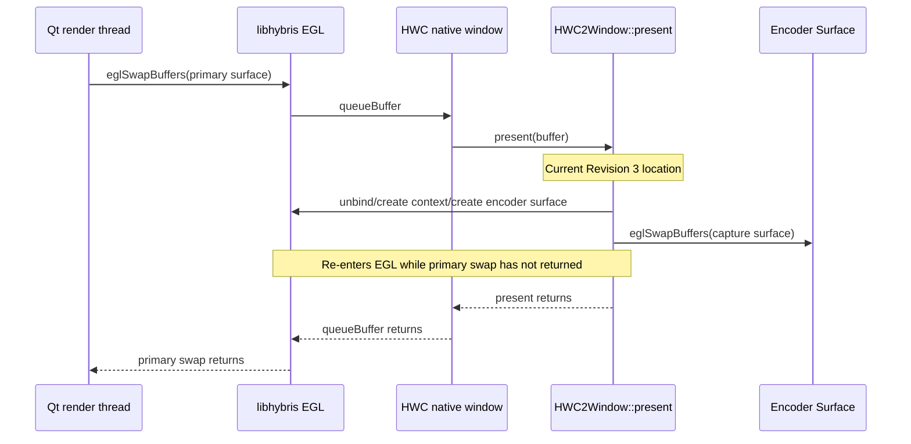
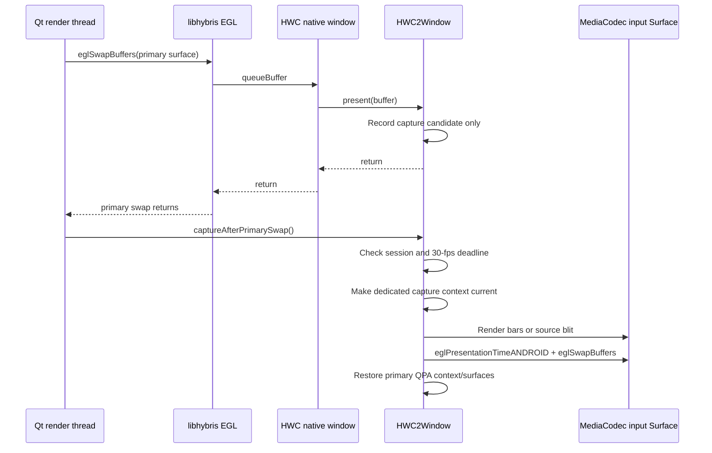

# HWC → H.264 Encoding — Revision 3.1: Remove Re-entrant EGL Capture and Prove the Hybris Surface Path

**Date:** 2026-08-09; updated 2026-09-20  
**Status:** Gates 0 through 3 are passed. The remote Codec2 producer, libhybris EGL path, post-primary-swap QPA scheduling, paced sessions, and real vertically corrected HWC source encoding are proven at 1080x2520. Gate 4 (GStreamer integration and timestamp-preserving container output) is next.  
**Supersedes:** the **Gate 2 implementation approach** in `wiki/hwc-h264-encoding-revision3.md`. It retains Revision 3's Surface-input architecture, opaque QPA/libminisf ABI, and rejection of the raw metadata/`attachBuffer()` paths.

## 1. Decision

A Revision 3.1 rewrite is necessary for the QPA capture scheduling point, but it is blocked behind an earlier libhybris/remote-Surface interoperability diagnosis (Gate 2.1a/2.1b).

The original primary failure was not evidence that the hardware AVC encoder, Binder hand-off, or the generic `ANativeWindow *` bridge was inherently unusable. Gate 2.1 has now shown that this statement needs a narrower interpretation: the codec and same-process native Android path are proven, while the remote producer plus Linux/libhybris path is not.

- `screencap_surface_enc_test` proved that the target can encode `1080x2520` H.264 from a MediaCodec input Surface, twice in one process.
- The recorder starts, registers generations, and QPA's `libminisf` bridge acquires/releases the registered Surface target.
- The remaining definitive failure is QPA-side `eglCreateWindowSurface(...)=EGL_NO_SURFACE`, with `EGL_BAD_ALLOC`, followed by visible UI blocking and zero output.

However, the existing QPA code calls the encoder EGL path **from inside the primary surface's native-window `queueBuffer()` callback**. This makes the capture EGL calls re-entrant with the primary `eglSwapBuffers()` that caused `queueBuffer()`.



`HWComposerNativeWindow::queueBuffer()` calls `present()` synchronously while holding its native-window mutex (`libhybris/.../hwcomposer_window.cpp`). `HWC2Window::present()` currently invokes `captureInit()` and `captureFrame()` (`qt5-qpa-hwcomposer-plugin/hwcomposer/hwcomposer_backend_v20.cpp`). `captureInit()` then calls `eglMakeCurrent`, `eglCreateContext`, and `eglCreateWindowSurface`; `captureFrame()` calls an additional `eglSwapBuffers`.

Calling those EGL operations before the original swap returns is an invalid and high-risk scheduling model. It plausibly explains both observed symptoms:

1. a vendor EGL implementation rejects or cannot allocate the second window surface while its first swap is active (`EGL_BAD_ALLOC`); and
2. an encoder swap or repeated failed allocation stalls the UI render thread, which is also the primary compositor thread.

This is a stronger explanation than the former “try a different EGL context/config” loop. It must be eliminated before judging the Surface-input design.

---

## 2. Findings from the last implementation round

| Finding | Evidence | Consequence |
|---|---|---|
| The Gate-1 harness is valid but does **not** test hybris or re-entrant swapping. | `droidmedia/tools/screencap_surface_enc_test.cpp` links native Android `libEGL`/`libGLESv2`, creates its EGL surface outside another swap, starts MediaCodec before EGL setup, paces submissions at 30 fps, calls `eglPresentationTimeANDROID`, and drains output while feeding. | It proves the codec/input-Surface capability, not QPA/libhybris interoperability. |
| QPA enters capture from the wrong call stack. | `present()` calls `captureInit()`/`captureFrame()` around lines 294–303; `HWComposerNativeWindow::queueBuffer()` invokes `present()` synchronously around lines 249–264. | Do not create, bind, destroy, or swap an encoder EGL surface from `present()`. |
| The encoder target is published before the codec is started. | `screen_capture_surface_encoder_start()` calls `registerProducer()` before `mCodec->start()`. The successful standalone harness calls `codec->start()` before `setupEgl()`. | QPA can acquire and connect EGL to an input Surface whose consumer is not yet started. This is a concrete race and must be fixed. |
| QPA is not paced to the registered encoder rate. | Gate 2 enabled `QPA_HWC_SCREENCAP_FRAME_SKIP=1`, i.e. every display frame; the encoder is configured for 30 fps. QPA has no registered FPS and no time-based cadence. | A 60/90/120 Hz display can fill the encoder BufferQueue and block `eglSwapBuffers()` even if surface creation succeeds. |
| QPA does not set encoder presentation timestamps. | The standalone harness resolves and calls `eglPresentationTimeANDROID`; `captureFrame()` does not. | Output timestamps are implementation-defined and cadence cannot be audited accurately. |
| Failed initialization retries on every rendered frame. | On an `eglCreateWindowSurface()` failure, `captureInit()` releases the target but leaves `m_captureEnabled` true. The next `present()` immediately tries again. | A persistent driver failure can become allocation/Binder churn on the UI thread and itself appear as a frozen UI. |
| The generic `ANativeWindow *` libhybris patch was necessary but is not a proof of the full path. | `libhybris` commit `8ac75ab` changed `eglplatform_hwcomposer.cpp` from an invalid `HWComposerNativeWindow *` cast to generic `ANativeWindow *` retention. | Keep it, deploy it atomically, and test it separately. It only fixes ownership/type handling at `hwcomposerws_CreateWindow()`. |
| Gate-2 teardown has no producer-detach protocol. | `screen_capture_surface_encoder_stop()` stops the codec before unregistering its producer; QPA may still consider the generation current and attempt a capture swap against a stopped codec. | Invalidate the session before stopping the codec, and make all waits bounded. |

The last definitive `EGL_BAD_ALLOC` preceded the final dedicated-context experiment. The latest run did not capture an equally precise post-change error. Therefore this document treated nested EGL execution as the leading hypothesis, **not a proven diagnosis**, and defined tests that separate it from a libhybris window/configuration defect.

### 2.1 Gate 2.1 device result (2026-08-10)

The new standalone Linux/libhybris harness was run while normal lipstick remained active and QPA capture was disabled:

```text
HYBRIS_EGLPLATFORM=hwcomposer \
  /usr/libexec/qt5-qpa-hwcomposer-plugin/hwcomposer_screencap_egl_test \
  1080 2520 30 60 15

waiting up to 15 seconds for 1080x2520 recorder target...
acquired recorder target generation=1 native-window=0x3b9c4e60
libhybris EGL initialized: 1.5, vendor=Android
eglCreateWindowSurface(MediaCodec input Surface) failed: 0x3003
Gate-2.1 hwcomposer/libhybris EGL test: FAIL
```

The recorder had successfully registered a running `1080x2520 @30fps` encoder session, but received no frames and produced an empty H.264 file. This reproduces `EGL_BAD_ALLOC` in a separate process with no primary QPA swap in its call stack. Therefore:

- Re-entrant QPA capture remains an independent defect that must be fixed **after** EGL interoperability is proved.
- It is **not** the immediate explanation for `eglCreateWindowSurface()` failing at Gate 2.1.
- Do not implement the QPA post-swap rewrite, source blit, or GStreamer integration yet.

The native same-process Gate-1 harness is insufficient here because it never sends the producer over Binder.

### 2.2 Gate 2.1a device result and root-cause hypothesis (2026-08-10)

The Android-native remote-producer control also failed before it could render:

```text
acquired remote producer generation=5 native-window=0xb400007646c95650
Android EGL initialized: 1.5, vendor=Android
EGL config: id=9 surface=0x15a5 renderable=0x45 recordable=1 visual=1 rgba=8/8/8/8
eglCreateWindowSurface(remote MediaCodec input Surface) failed: 0x3003
Gate-2.1a native remote-Surface EGL test: FAIL
```

This eliminates QPA, libhybris, and `eglplatform_hwcomposer.so` as the immediate source of the failure. The target is a remote MediaCodec input producer problem.

The exact device framework source gives a strong root-cause explanation:

1. `Surface::connect()` invokes `IGraphicBufferProducer::connect(..., NATIVE_WINDOW_API_EGL, ...)` (`frameworks/native/libs/gui/Surface.cpp`).
2. The active Codec2 path (`CCodec::createInputSurface()`) obtains an `H2BGraphicBufferProducer`, a local `BnGraphicBufferProducer` adapter around the Codec2 HIDL producer (`frameworks/av/media/codec2/sfplugin/CCodec.cpp` and `frameworks/native/libs/gui/include/gui/bufferqueue/1.0/H2BGraphicBufferProducer.h`).
3. The recorder publishes that local Binder adapter through `sailfish.screencap`, but `ScreenCaptureSurfaceEncoder` had not called `ProcessState::self()->startThreadPool()`. A remote client can receive the Binder endpoint yet its `connect()` transaction has no recorder Binder worker to service it. Vendor EGL exposes the resulting failure only as `EGL_BAD_ALLOC`.
4. The passing Gate-1 harness does call `ProcessState::self()->startThreadPool()` before its direct same-process rendering session, which is why it did not expose the missing remote-service condition.

`screen_capture_surface_encoder_start()` now starts the recorder Binder thread pool **before** target registration.

### 2.3 Gate 2.1a repeat — passed (2026-08-10)

After rebuilding the recorder/test binary with the Binder-pool fix, the remote Android EGL test passed:

```text
Gate-2 Surface capture test: 1080x2520 @30 fps for 20 seconds
producer registered; encoder and output drain are ready
output format: 1080x2520
Gate-2 recorder stopped: frames=60 error=0 output=/tmp/screencap-gate2.1a.h264

Android EGL initialized: 1.5, vendor=Android
EGL config: id=9 surface=0x15a5 renderable=0x45 recordable=1 visual=1 rgba=8/8/8/8
frame 1/60: ... swap=1ms
...
frame 60/60: ... swap=2ms
Gate-2.1a native remote-Surface EGL test: PASS
```

`ffprobe` identifies a `1080x2520`, 30-fps High-profile H.264 stream, and FFmpeg decodes the deterministic color bars. This proves all of the following together:

- the active codec is usable with a remotely connected input producer;
- the Binder service can publish that producer across processes;
- the recorder's Binder pool services the Codec2 adapter endpoint;
- a remote `android::Surface(producer, true)` can connect as EGL, render, swap, and drain output;
- the earlier `EGL_BAD_ALLOC` was caused by the recorder's missing inbound Binder pool, not the Android EGL config, BufferQueue design, libhybris, or QPA scheduling.

The next required work was Gate 2.1b, then a repeat of Gate 2.1 with the `hwcomposer` libhybris platform. QPA capture remained disabled for both.

### 2.4 Gate 2.1b and Gate 2.1 repeat — passed (2026-08-10)

The corrected recorder session was used with the Linux/libhybris harness in both modes:

```text
HYBRIS_EGLPLATFORM=null
using libhybris EGL platform: null
EGL config: id=9 surface=0x15a5 renderable=0x45 recordable=1 visual=1 rgba=8/8/8/8
frame 1/60: ... swap=1ms
...
Gate-2.1 hwcomposer/libhybris EGL test: PASS

HYBRIS_EGLPLATFORM=hwcomposer
using libhybris EGL platform: hwcomposer
EGL config: id=9 surface=0x15a5 renderable=0x45 recordable=1 visual=1 rgba=8/8/8/8
frame 1/60: ... swap=0ms
...
frame 60/60: ... swap=2ms
Gate-2.1 hwcomposer/libhybris EGL test: PASS
```

The `hwcomposer` output decoded as the expected color bars. Therefore the patched `eglplatform_hwcomposer.so` works for a MediaCodec input `ANativeWindow`; do not modify libhybris for this issue. The former QPA failure is now isolated to its old re-entrant scheduling location.

---

## 3. Corrected capture flow

The existing Surface-input direction remains the product candidate. Only the QPA scheduling and session contract change.



### Invariants

1. `HWC2Window::present()` must perform only normal HWC client-target work plus recording a candidate. It must not call capture EGL, Binder target acquisition, or any potentially blocking operation.
2. `captureAfterPrimarySwap()` is called by `HwComposerBackend_v20::swap()` **only after** the outer primary `eglSwapBuffers()` has returned.
3. The post-swap capture runs on the same thread that owns the primary EGL context. Do not queue it to an arbitrary Qt thread.
4. The source buffer is used synchronously before the next primary render. It is not handed to a background worker; the current `HWComposerNativeWindow` rotates its finite source-buffer vector independently of capture completion.
5. A capture error, slow operation, or stale session restores the QPA context/surfaces before it releases the opaque target.
6. Test bars remain the first producer. Real HWC EGL-image import is gated on test-bars success.

A background capture thread is **not** a safe quick fix. It would require an explicit source-buffer ownership/fence design, which the current round-robin libhybris native window does not provide.

---

## 4. Session and encoder lifecycle corrections

### 4.1 Start before publishing the target

`ScreenCaptureSurfaceEncoder` must make the codec ready before QPA can acquire its producer:

1. configure MediaCodec;
2. call `createInputSurface()`;
3. call `MediaCodec::start()`;
4. start the output-drain thread (or otherwise ensure it is ready to drain);
5. start the recorder process's inbound Binder thread pool, because Codec2 may return a local Binder producer adapter that remote QPA must transact with;
6. register the producer with `sailfish.screencap`;
7. report the active generation to the recorder.

On any failure after `createInputSurface()`, release the producer/codec without registering a target. This eliminates the current window where an active Binder generation names an unstarted codec consumer.

`screen_capture_surface_encoder_new()` should also report the actual failure from `createInputSurface()`, rather than logging the prior `configure()` result when the combined conditional fails.

### 4.2 Publish FPS as part of the private session contract

The service currently publishes width, height, and generation only. Extend the private Binder/C ABI session state to carry the requested frame rate:

```text
producer + width + height + fps + generation
```

The QPA capture path must use `clock_gettime(CLOCK_MONOTONIC)` and submit only when `now >= nextCaptureNs`, where the period is `1e9 / fps`. It must not assume a 60 Hz primary display or use `FRAME_SKIP` as product pacing.

`QPA_HWC_SCREENCAP_FRAME_SKIP` may remain as a diagnostic multiplier, but `QPA_HWC_SCREENCAP_FPS=30` (or the registered encoder FPS) is the normal control. The initial target is 30 fps.

Resolve `eglPresentationTimeANDROID` through `eglGetProcAddress()` and set the same monotonic timestamp immediately before each encoder `eglSwapBuffers()`. Gate 2 must log and fail clearly if the extension is unexpectedly unavailable on this device, since the standalone test already found it.

### 4.3 Make target state queryable and failure-latched

Replace “acquire a new Surface every frame until it works” with a small C-only status protocol in `libminisf`:

```c
typedef struct MinisfScreenCaptureSessionInfo {
    uint64_t generation;
    int width;
    int height;
    int fps;
} MinisfScreenCaptureSessionInfo;

/* Returns 1 only for an active registered encoder session. */
int minisf_screen_capture_session_query(MinisfScreenCaptureSessionInfo *info);

/* Acquires only the session generation obtained from query(). */
void *minisf_screen_capture_target_acquire(uint64_t expected_generation);
```

The exact names can differ, but the properties must hold:

- QPA polls the status at a bounded idle interval (for example 250 ms), not once per render frame.
- Once creation or swap fails for generation *G*, QPA releases its target and marks *G* failed. It does not retry expensive target/surface creation until a new generation appears.
- While active, QPA re-checks session state at the same bounded interval, not via a Binder `getProducer()` call for every encoded frame.
- `target_acquire(expected_generation)` verifies the generation again to contain the query/acquire race.
- QPA still sees only opaque targets, basic scalar data, and a native-window pointer. Android framework C++ types do not cross the QPA ABI.

### 4.4 Stop and restart ordering

For a normal recorder stop:

1. make the generation inactive in `ScreenCaptureService` first;
2. QPA sees the changed generation during its bounded state check, stops submitting, restores its primary context, destroys the capture EGL surface/context, and releases the target;
3. request `signalEndOfInputStream()` where the codec remains usable, drain output to EOS within a bounded timeout, then stop/release the codec;
4. if QPA does not detach in time or a capture call is already blocked, stop the codec to force the BufferQueue producer to fail, then complete QPA teardown on its next return;
5. never leave a stale generation published after `MediaCodec::stop()`.

A full synchronous “wait forever for QPA acknowledgment” is forbidden: the display can be idle. If an acknowledgment mechanism is added, it is diagnostic/bounded only.

---

## 5. Implementation plan

### Step 0 — Preserve the boundary and package the actual dependency set

No QPA code may gain Android framework C++ headers or `libdroidmedia` linkage. The existing opaque `minisf_screen_capture.h` direction remains correct.

Build and deploy these artifacts as a matched set for every Gate-2 run:

| Artifact | Required reason |
|---|---|
| `libdroidmedia.so`, `libminisf.so`, recorder test | revised session/lifecycle ABI |
| `libhwcomposer.so` | post-swap capture scheduler |
| `eglplatform_hwcomposer.so` from the `libhybris` `hwenc` commit | generic `ANativeWindow *` retain/release fix |

The `libhybris` change is on a separate nested checkout/branch and is not represented as a normal `mw` submodule update. Record the exact package revision in deployment notes; otherwise a rebuilt QPA plugin can silently run with the old invalid `HWComposerNativeWindow *` cast.

### Step 1 — Add a hybris-only interoperability harness

Before changing more QPA rendering code, add a small **Linux/libhybris-linked** diagnostic executable, for example:

```text
qt5-qpa-hwcomposer-plugin/tools/hwcomposer_screencap_egl_test.cpp
```

It must:

1. use the same public libhybris EGL frontend and `HYBRIS_EGLPLATFORM=hwcomposer` as QPA;
2. resolve only the opaque `libminisf` C ABI via `android_dlopen()`/`android_dlsym()`;
3. wait for a recorder session, acquire its opaque target, and pass the returned native-window value directly to `eglCreateWindowSurface()`;
4. choose the same recordable RGBA/GLES2 config as QPA;
5. create a dedicated GLES2 context, render deterministic bars, set presentation time, pace at 30 fps, drain through the existing recorder process, and cleanly release all objects;
6. run outside a primary QPA `eglSwapBuffers()` callback.

It must not import Android C++ classes, dereference the native-window pointer, or link `libgui`/`libbinder`/`libdroidmedia` into the Linux test binary.

**Purpose:** distinguish a generic hybris/platform/configuration failure from the current re-entrant QPA scheduling failure.

### Step 2 — Correct encoder publication and test it independently

Modify:

- `droidmedia/screen_capture_surface_encoder.cpp`
- `droidmedia/screen_capture_surface_encoder.h`
- `droidmedia/screen_capture_service.{h,cpp}`
- `droidmedia/minisf_screen_capture.cpp`
- `droidmedia/tools/screencap_surface_capture_test.cpp`

Required changes:

- start the codec before `registerProducer()`;
- add FPS to the private session record and Binder parcels;
- add the low-frequency session-state query plus generation-checked target acquire;
- make stop invalidate the service generation before stopping the codec;
- make the recorder test print readiness only after registration succeeds, log all received output PTS/flags in debug mode, and exercise repeated start/stop;
- preserve one active session only and retain the existing dimension equality check.

The standalone Android harness remains unchanged as the known-good codec baseline, except for any logging needed to compare its chosen EGL configuration to the hybris test.

### Step 3 — Move QPA capture after the primary swap

Modify:

- `qt5-qpa-hwcomposer-plugin/hwcomposer/hwcomposer_backend_v20.{h,cpp}`

Detailed shape:

1. Have `HWC2Window::present(buffer)` retain only a synchronous capture candidate for the immediate post-swap phase. Do not call `captureInit()` or `captureFrame()` there.
2. Give `HwComposerBackend_v20` a non-owning way to invoke `HWC2Window::captureAfterPrimarySwap()` after its `eglSwapBuffers(display, surface)` call returns successfully.
3. Keep the candidate valid only for that immediate call. It must never be queued to a worker or used after a subsequent primary render begins.
4. In `captureAfterPrimarySwap()`, query session state at the bounded interval; acquire/initialize only for a new non-failed generation; then enforce the time-based capture deadline.
5. In `captureInit()`, create the dedicated context and encoder EGL window surface at this ordinary, non-re-entrant EGL safe point. Do not unnecessarily unbind the primary QPA context merely to create a second, unshared context; save/restore the current context/surfaces only around actual capture rendering.
6. First render one test-bars frame and swap it. Only after this passes enable the paced test-bars loop. Do not touch source EGL-image import in this step.
7. Add a circuit breaker: any failed EGL operation, capture operation exceeding the selected latency budget, or generation change restores QPA state, releases the target, and latches that generation as failed.

Do not change the normal HWC client-target order or reintroduce capture work before `hwc2_compat_display_set_client_target()`/`hwc2_compat_display_present()`.

### Step 4 — Add useful, bounded diagnostics

Add capture-only logging guarded by `QPA_HWC_SCREENCAP_DEBUG=1`:

- generation, dimensions, FPS, and session transitions;
- current thread id and whether capture runs before or after the outer primary swap return;
- chosen config ID and `EGL_SURFACE_TYPE`, `EGL_RENDERABLE_TYPE`, `EGL_RECORDABLE_ANDROID`, RGBA sizes, and native visual ID;
- duration and result of target query/acquire, `eglCreateContext`, `eglCreateWindowSurface`, `eglMakeCurrent`, render, capture `eglSwapBuffers`, and restore;
- `eglGetError()` immediately after an operation that fails, with no unrelated EGL call in between;
- presentation timestamp and submitted-frame number;
- circuit-breaker reason and failed generation.

Use a short threshold such as one display period for a warning and a conservative, explicit hard cutoff for disabling further submission. The exact cutoff must be based on device measurements; it must not be an infinite wait.

The recorder logs component name, start/register ordering, output format, output PTS/flags, encoded bytes, stop result, and unregister generation.

### Step 5 — Only then perform the real HWC source blit

Once post-swap test bars produce a decodable stream:

1. import the `HWComposerNativeWindowBuffer` as an EGL image in the dedicated capture context;
2. render it to the encoder surface at the session rate;
3. validate orientation, crop, alpha/color behavior, and moving on-screen content;
4. keep source import and source blit failures separate from encoder-surface failures in logs;
5. test display configuration changes and force a new recorder generation on dimension mismatch.

This does not revive `attachBuffer()`, raw `VideoGrallocMetadata`, or CPU-copy routes as a performance solution.

---

## 6. Gated validation matrix

No later gate passes by inference from an earlier one.

### Gate 2.0 — Build and static boundary

- Build the revised `droidmedia`, QPA plugin, libhybris EGL platform, and test harness.
- Verify QPA still contains no `gui/`, `ui/`, `binder/`, `media/`, or droidmedia private Android C++ include.
- Verify the QPA RPM has no direct Android framework/droidmedia link dependency.

**Pass:** clean builds and an atomically installed matching artifact set.

### Gate 2.1 — Hybris EGL target harness

Start the recorder, then run the new hybris-only harness at `1080x2520`, 30 fps, with deterministic test bars.

**Pass:** a non-empty H.264 file; `ffprobe` reports the requested AVC dimensions; FFmpeg decodes changing bars; clean target release and no process hang.

**If it fails:** stop. Compare the logged config and window lifetime with the native standalone harness. Do not change QPA source blitting or GStreamer.

**Initial result (2026-08-10): failed** with `EGL_BAD_ALLOC (0x3003)` before QPA capture is enabled. The cause was corrected by Gate 2.1a's recorder Binder-pool fix. **Final result: passed** in both `null` and `hwcomposer` modes; proceed to Gate 2.2.

### Gate 2.1a — Native Android EGL over the remote Binder producer

Start the same recorder session, then run `screencap_surface_remote_egl_test` at `1080x2520`, 30 fps. This Android-native executable gets the producer from `sailfish.screencap` in a second process, constructs `android::Surface(producer, true)`, and calls the native Android EGL/GLES stack. It deliberately does not use libhybris.

**Pass:** decodable changing-bar H.264 output. This proves the remote producer, Binder transfer, `Surface` construction, codec consumer, and Android EGL route. A continued Gate 2.1 failure then isolates the blocker to libhybris’s EGL/platform path.

**Actual result (2026-08-10): passed.** The recorder emitted 60 access units with no error, `ffprobe` reported `1080x2520` H.264 at `30/1` fps, and the decoded PNG showed color bars. The missing inbound recorder Binder pool was the root cause of the initial failure.

**Fail:** retain the exact EGL error plus EGL-config logs. The fault is in the remote producer/session setup or a device limitation on using that producer cross-process; do not alter libhybris or QPA based on this result.

### Gate 2.1b — libhybris `null` platform control

Run this only if Gate 2.1a passes after the recorder Binder-pool fix. With the same recorder session, run `hwcomposer_screencap_egl_test` with `HYBRIS_EGLPLATFORM=null`. The null platform passes a non-null supplied `ANativeWindow` directly to Android EGL, without the hwcomposer platform's retain/release hook.

**Actual result (2026-08-10): passed.** The `null` and `hwcomposer` modes both submitted 60 paced frames and decoded expected color bars. This clears Gate 2.1.

- **null passes, hwcomposer fails:** `eglplatform_hwcomposer.so` remains the root-cause area; inspect and instrument its `CreateWindow()`/`DestroyWindow()` ownership logic and deployed artifact.
- **both null and hwcomposer fail, while Gate 2.1a passes:** investigate the generic Linux libhybris EGL frontend/Android linker boundary, not QPA.
- **both pass:** resume the original QPA post-primary-swap test-bars plan at Gate 2.2.

After any initial Gate 2.1 failure, rerun `HYBRIS_EGLPLATFORM=hwcomposer` with the corrected recorder session; that is the actual Gate 2.1 result used to make the Gate 2.2 decision.

### Gate 2.2 — QPA post-swap, one test-bars frame

With the harness proven, run QPA with capture enabled, post-swap scheduling, and a one-frame test-bars mode. The implementation must not enter the recorder ABI or EGL path from `HWC2Window::present()`; it records only a candidate there and runs capture after `HwComposerBackend_v20::swap()` receives a successful return from primary `eglSwapBuffers()`.

**Pass:** QPA creates the window surface and performs one successful capture swap after the primary swap returns; the recorder receives an AVC access unit; the UI remains responsive.

A failure here with Gate 2.1 passing confirms a QPA scheduling/context-lifetime issue, not an opaque target ABI failure.

### Gate 2.3 — QPA post-swap paced bars

Run 30 fps for at least 60 frames and then two complete start/stop sessions at `1080x2520`.

**Pass:** decodable H.264 in both sessions, monotonic/expected PTS, no capture operation over the agreed latency budget, no UI freeze, and no retry storm after an injected/observed failure.

### Gate 3 — Real QPA source content

Replace test bars with the source EGL-image blit and validate an on-screen changing pattern.

**Pass:** correct content/orientation and no capture-only GPU errors or persistent UI hitch.

### Gate 4 — GStreamer integration

Only after Gate 3, refactor `droidscreencapsrc` to use `ScreenCaptureSurfaceEncoder`. Retain bounded output buffering, flush-before-join, keyframe-aware dropping, and restart cleanup from Revision 3.

---

## 7. Required device evidence for every Gate-2 run

Use a fresh output file and retain paired QPA/recorder logs. At minimum:

```sh
ffprobe -v error -show_streams /tmp/screencap-gate2.h264
ffmpeg -v error -i /tmp/screencap-gate2.h264 \
  -frames:v 1 /tmp/screencap-gate2.png
```

Record:

- package/build revision of QPA, `libdroidmedia`, `libminisf`, `libEGL`, and `eglplatform_hwcomposer.so`;
- encoder component name and complete dimensions/FPS/bitrate;
- service generation and start/register/unregister ordering;
- exact EGL config ID, surface/renderable/recordable/native-visual/RGBA attributes and the first failing EGL error, if any;
- for Gate 2.2+, primary-swap return → capture start ordering;
- capture swap latency distribution and UI behavior;
- `ffprobe` output plus decoded-frame visual result.

A non-null target, successful Binder registration, or a zero error callback is not a capture pass. A Gate passes only with an actual decodable artifact and bounded UI behavior.

---

## 8. Explicit non-solutions

- Do not add private Android headers or `libgui`/`libbinder` linkage to QPA.
- Do not call capture EGL APIs from `present()` or any native-window callback reached during the primary swap.
- Do not retry a failed same-generation target every rendered frame.
- Do not feed the encoder at display rate merely because a display frame was rendered.
- Do not move source-buffer use to a worker thread without a new ownership/fence design.
- Do not return to rejected raw metadata, unsafe HWC source `attachBuffer()`, or the two-CPU-copy raw fallback to bypass this Gate-2 investigation.
- Do not proceed to source import, GStreamer, SELinux changes, or performance claims until Gate 2.3 passes.
