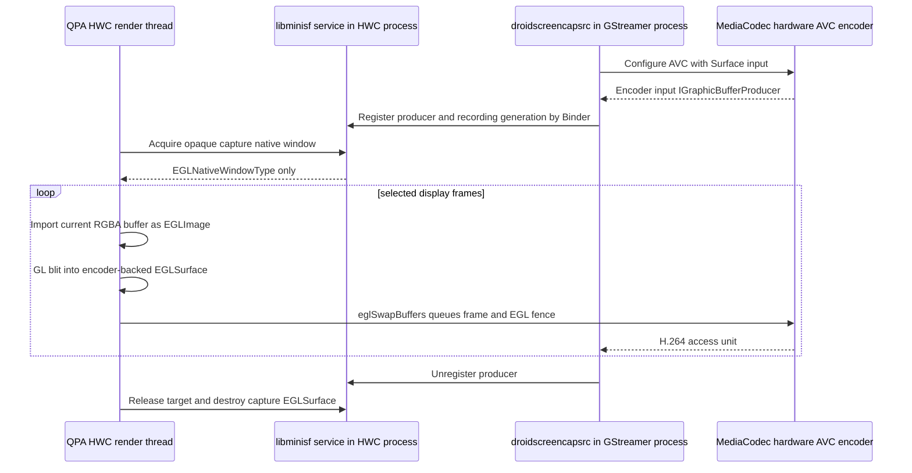

# HWC → H.264 Encoding — Revision 3: Restore the Hybris Boundary and Re-evaluate the Input Path

**Date:** 2026-08-09  
**Status:** Gate 0 passed. Gate 1 passed on-device, including a paced two-session run at `1080x2520`. Gate 2 build and Binder registration passed, but Gate 2 runtime remains **failed**: QPA acquires the encoder target, then cannot complete the encoder EGL window-surface path; the UI render thread blocks and the output file remains zero bytes.
**Supersedes as the recommended direction:** the BufferQueue/raw-`MediaSource` v1 direction in `hwc-h264-encoding-revision2.md` and `hwc-h264-exec3.md`. The current Surface-input integration is an investigated prototype, not a working device recorder.

## 1. Executive conclusion

The QPA plugin build failure is expected and confirms that the current third-round boundary refactor is incomplete:

```text
hwcomposer_backend_v20.cpp:60:10: fatal error:
 gui/IGraphicBufferProducer.h: No such file or directory
```

The QPA plugin should **not** be made to compile this code by adding private AOSP `gui/` headers, `libgui`, `libbinder`, or Android-side `libdroidmedia` to its qmake build. The plugin is a Sailfish/Linux/libhybris consumer. Its build intentionally sees the exported hybris/android headers, not private Android framework C++ headers. More importantly, passing Android C++ `sp<T>` objects across that boundary is the wrong ownership and ABI design.

The prior `libminisf` bridge moved BufferQueue construction into Android code, which was the correct first step, but then leaked `IGraphicBufferProducer *` back into the QPA plugin. The plugin still includes and operates on:

- `gui/IGraphicBufferProducer.h`
- `gui/IGraphicBufferConsumer.h`
- `gui/BufferItem.h`
- `ui/Fence.h`
- `android::sp<IGraphicBufferProducer>`, `android::sp<GraphicBuffer>`, and `android::Fence`

Therefore the bridge is opaque only in name, not in operation.

There is also a larger architectural correction:

1. The target Codec2 stack rejected the raw `GraphicBuffer` metadata-input route (`meta_data=1`).
2. The supposedly one-copy raw fallback is not one copy. `AsyncCodecSource::queueInputBuffer()` copies every `MediaBuffer` into a `MediaCodec` input buffer.
3. Passing an HWC source buffer through `attachBuffer()` is unsafe with the current libhybris native window: its producer rotates through a fixed vector of buffers and does not wait for a separate capture BufferQueue to release that source buffer.
4. The current raw-copy test has never emitted a valid H.264 artifact, so codec creation is not evidence that the selected raw color-format/input contract works.

The recommended next experiment is the standard Android hardware-encoding model: **configure `MediaCodec` with an input `Surface`, then GPU-blit the composed QPA frame into an EGL surface backed by that input Surface.** This avoids the rejected raw metadata path, avoids CPU pixel copies, and lets EGL/BufferQueue/MediaCodec own the producer fences and buffer lifetime.

This remains a device-gated proposal, not a claim of success. The standalone Android-side EGL/Surface path has now been proven on-device, but the QPA/libhybris integration has not: QPA can acquire the target, while the encoder EGL window-surface/capture path still blocks or returns `EGL_BAD_ALLOC` and produces no output.

---

## 2. Evidence from the current tree

### 2.1 The QPA build boundary is real

`qt5-qpa-hwcomposer-plugin/hwcomposer/hwcomposer.pro` only declares the normal QPA/hybris dependencies:

```qmake
PKGCONFIG += android-headers libhardware hybris-egl-platform
```

The reported command line consequently exposes `/usr/include/droid-devel/droid-headers`, but not AOSP private `frameworks/native/libs/gui/include`. Thus `<gui/IGraphicBufferProducer.h>` cannot resolve.

This is not a missing one-line `PKGCONFIG` declaration:

- the plugin must not link Android framework C++ libraries directly;
- `libminisf.so` is already dynamically loaded with `android_dlopen()` specifically to keep Android-side code behind hybris;
- the current `MinisfScreenCaptureApi::producer()` returns a `void *`, then QPA casts it to `android::IGraphicBufferProducer *` and stores it in an `android::sp`. That still requires the private Android C++ type and its methods in QPA.

**Rule for the replacement:** QPA may pass plain C data and standard EGL/native-window pointers through a C ABI. It must not include `gui/*`, `ui/*`, `binder/*`, `media/*`, or `droidmedia` private C++ headers, and it must never own or call a method on an Android `sp<T>` object.

### 2.2 What is known about the display buffer

The existing HWC v2 backend creates the QPA window with:

```cpp
HAL_PIXEL_FORMAT_RGBA_8888
```

in `qt5-qpa-hwcomposer-plugin/hwcomposer/hwcomposer_backend_v20.cpp`. The `present(HWComposerNativeWindowBuffer *buffer)` argument is the completed QPA render buffer. It is a useful GPU source; no SurfaceFlinger screen capture API is involved or required.

The current QPA code can continue to use its existing public/hybris-side `HWComposerNativeWindowBuffer` and EGL/GLES interfaces to make an `EGLImageKHR` from the source `buffer_handle_t`. What must be removed is all direct Android BufferQueue destination management.

### 2.3 What Phase 0 actually proved—and did not prove

`wiki/hwc-h264-test-notes-phase0.md` records these useful results:

| Configuration | Result |
|---|---|
| `OMX_COLOR_FormatAndroidOpaque` + `meta_data=1` | `droid_media_codec_create_encoder_raw()` returned `NULL` |
| `OMX_COLOR_FormatAndroidOpaque` + `meta_data=0` | codec object was created/configured |

The first result rules out the planned raw `VideoGrallocMetadata`/`GraphicBuffer` passthrough on this target's Codec2 path.

The second result is **not** an encode pass. The harness crashed with `MediaBuffer.cpp:97 CHECK_EQ(mRefCount, 0) failed: 1 vs. 0` before it produced the required non-empty, decodable H.264 file. The earlier Phase-0 note and execution log statements that described this as a harness-only, non-blocking success are superseded by this review.

Additionally, `OMX_COLOR_FormatAndroidOpaque` normally describes Surface/opaque producer input. A successful `configure()` does not establish that arbitrary RGBA bytes copied into normal codec input buffers have the required raw color-format semantics. This must be demonstrated by decoding produced output, not inferred from the advertised format list.

### 2.4 The raw path contains at least two CPU copies

The current copy-mode `ScreenCaptureMediaSource::read()` does:

```text
GraphicBuffer::lock() → memcpy into a MediaBuffer
```

However, `droidmedia/AsyncCodecSource.cpp` then does:

```cpp
memcpy(inbuf->base(), buffer->data() + buffer->range_offset(), cpLen);
mCodec->queueInputBuffer(...);
```

So the actual raw path is:

```text
screen GraphicBuffer
  └─ CPU copy #1 → MediaSource MediaBuffer
       └─ CPU copy #2 → MediaCodec input buffer
            └─ hardware codec
```

With the currently implemented HWC GPU-blit capture queue, it is worse:

```text
source screen buffer
  └─ GPU RGBA blit → capture GraphicBuffer
       └─ CPU copy #1 → MediaSource MediaBuffer
            └─ CPU copy #2 → MediaCodec input buffer
```

This does not meet Revision 2's intended one-CPU-copy v1 goal. It is still hardware *encoding*, but it is not a minimal-copy capture design.

### 2.5 `attachBuffer()` does not safely retain HWC source buffers

Revision 2 proposed attaching the source HWC buffer to the capture BufferQueue to remove the GPU blit. That proposal must not be implemented against the current libhybris `HWComposerNativeWindow`.

`libhybris/.../hwcomposer_window.cpp` cycles unconditionally through `m_bufList` in `dequeueBuffer()`:

```cpp
HWComposerNativeWindowBuffer *b = m_bufList.at(m_nextBuffer);
m_nextBuffer = (m_nextBuffer + 1) % m_bufList.size();
```

It does not consult a capture BufferQueue, a capture consumer release fence, or an `attachBuffer()` ownership state. A strong C++ reference also would not help: buffer reuse is controlled by this round-robin producer, not object refcounting.

Consequently, after QPA queues the source to a capture BufferQueue, EGL can render into the same source handle again while the capture consumer is CPU-locking or encoding it. Limiting `maxAcquiredBufferCount` on the capture queue does not constrain the independent HWC native window.

**Decision:** do not pursue the direct-source `attachBuffer()` route unless libhybris itself is redesigned to make source-buffer reuse depend on capture release fences. That is a separate, high-risk native-window change—not a small HWC capture hook.

---

## 3. Concrete defects to fix or remove before retesting the raw prototype

These items are relevant if the current raw path is kept as a diagnostic fallback. They do not make it the preferred product path.

### 3.1 Copy-mode `MediaBuffer` ownership is inconsistent with `AsyncCodecSource`

The copy branch of `ScreenCaptureMediaSource::read()` and both branches of `tools/screencap_enc_test.cpp` return newly allocated `MediaBuffer`s without calling `add_ref()`.

The existing, working droidmedia input path in `droid_media_codec_queue()` uses:

```cpp
buffer->setObserver(codec);
buffer->set_range(...);
buffer->add_ref();
codec->m_src->add(buffer);
```

`AsyncCodecSource::SourceReader` subsequently calls `buffer->release()` after it has synchronously copied the payload to the codec input buffer. The screen copy source follows the same producer/consumer contract but omits the initial reference. This is the most direct code-level explanation for the observed lifetime/refcount assertion and must be fixed before interpreting any codec result.

For copy mode, the capture BufferQueue item is released immediately after the CPU copy. The returned `MediaBuffer` needs no `CaptureInputBuffer` observer, but it does need the reference ownership expected by `SourceReader`.

### 3.2 BufferQueue timestamps are nanoseconds; `MediaCodec` input timestamps are microseconds

QPA queues its current capture frame with `android::systemTime()`, and a `BufferItem` timestamp is nanoseconds. `ScreenCaptureMediaSource` currently stores `item.mTimestamp` directly in `kKeyTime`, while `AsyncCodecSource::queueInputBuffer()` uses that field as `timeUs`.

The source must set:

```text
kKeyTime = item.mTimestamp / 1000
```

The output wrapper's conversion from codec microseconds to GStreamer nanoseconds (`* 1000`) is then appropriate. Leaving this unchanged produces timestamps 1000× too large.

### 3.3 Encoder stop can block forever

`screen_capture_encoder_stop()` currently:

1. clears `mRunning`;
2. joins the output-poll thread;
3. only then calls `mCodec->stop()`.

The poll thread is blocked in `mCodec->read()` when no output is pending, so clearing a plain boolean does not wake it. `AsyncCodecSource::stop()` is the code that wakes its read/source threads. The order must be made stop/wake-first, join-second, with synchronization around the running state.

### 3.4 The current Binder service has no session replacement protocol

`ScreenCaptureService::setConsumer()` overwrites a single static consumer and dimensions. It has no generation, no clear/unregister operation, and no notification to a GStreamer process holding the old consumer. A hotplug/configuration change or QPA teardown can therefore leave the recorder blocked on an abandoned queue.

Any retained service design needs one active recording session, explicit unregister, and a monotonically increasing generation. Resolution changes should terminate/recreate the recording session rather than silently replacing an endpoint.

---

## 4. Recommended architecture: `MediaCodec` Surface input

### 4.1 Why this is the correct next path to test

On normal Android, hardware screen recording feeds the encoder through a `MediaCodec` input Surface. SurfaceFlinger/virtual display normally renders into that Surface; Sailfish HWC/QPA can instead render the already-composed client target into it.

This uses the hardware codec's intended opaque input contract rather than attempting to make `OMX_COLOR_FormatAndroidOpaque` work as a raw byte-buffer format.



The expected pixel path is:

```text
QPA RGBA GraphicBuffer
  └─ GPU texture/blit → MediaCodec input Surface
       └─ vendor graphics/codec conversion as required → hardware H.264
```

There is one GPU composition/blit, but no CPU map and no CPU pixel copy. The encoder input BufferQueue and its fences are managed by EGL/MediaCodec, which is exactly what the current direct BufferQueue design is trying to reimplement.

### 4.2 Android/droidmedia side: add a distinct Surface-input encoder

Do not force Surface input through `ScreenCaptureMediaSource` or overload the existing raw-input encoder wrapper. It has different lifecycle rules and must not start a `SourceReader` waiting for raw codec input indices.

Add a separate Android-side `ScreenCaptureSurfaceEncoder` API that:

1. selects a hardware AVC component;
2. configures it with the Surface input color format (`OMX_COLOR_FormatSurface` / the platform's equivalent), bitrate, FPS, profile, I-frame interval, and fixed recording dimensions;
3. calls the A14 `MediaCodec::createInputSurface()` API after successful configure;
4. wraps the returned producer in a local Android `Surface` when needed;
5. collects encoded access units using the existing output callback/poll machinery;
6. exposes ordinary C callbacks to `droidscreencapsrc` for H.264 buffers;
7. never creates `ScreenCaptureMediaSource`, sets `android._input-metadata-buffer-type`, or uses `VideoGrallocMetadata`.

The existing `AsyncCodecSource` supports configuring a codec with a `Surface` as an **output** target for decoding, but it does not currently expose an encoder input Surface and always creates/starts a raw `SourceReader`. Surface input requires a dedicated mode or a small separate codec wrapper; it must not be faked by giving the current raw-input wrapper a dummy `MediaSource`.

### 4.3 Service/bridge direction

Surface input reverses the current capture BufferQueue direction:

- the recorder/encoder process creates the encoder input producer;
- it registers that `IGraphicBufferProducer` with the existing `sailfish.screencap` service via Binder;
- `libminisf` in the HWC process receives the Binder proxy and constructs/owns the local Android `Surface` object;
- QPA only receives an opaque `EGLNativeWindowType`/`ANativeWindow *` pointer to pass to EGL.

A per-frame BufferQueue transaction is then performed by `eglSwapBuffers()` on the capture EGL surface. This is normal for a codec input Surface, but it means frame pacing and UI jank must be measured on-device. The previous desire to avoid a per-frame Binder operation cannot override the codec's native Surface-input contract.

### 4.4 Required QPA-facing C ABI

The `libminisf` ABI must contain only C-compatible, opaque values. One possible shape is:

```c
/* QPA-visible header: no Android framework C++ declarations. */
typedef void MinisfScreenCaptureTarget;

/* Returns NULL until a recorder has registered an encoder input Surface. */
MinisfScreenCaptureTarget *minisf_screen_capture_target_acquire(
    int width, int height, uint64_t *generation);

/* The result is only passed to eglCreateWindowSurface(). QPA never dereferences it. */
void *minisf_screen_capture_target_native_window(
    MinisfScreenCaptureTarget *target);

void minisf_screen_capture_target_release(
    MinisfScreenCaptureTarget *target);

/* Optional: lets QPA detect a stop/reconfigure before the next capture swap. */
int minisf_screen_capture_target_is_current(
    MinisfScreenCaptureTarget *target, uint64_t generation);
```

The concrete `IGraphicBufferProducer`, `Surface`, `sp<T>`, `Fence`, and BufferQueue objects stay inside `libminisf`/`libdroidmedia`. QPA resolves these symbols beside `startMiniSurfaceFlinger` through the existing `android_dlsym()` handle.

The present `init()`, `producer()`, and `destroy()` API should be retired rather than extended. Returning an Android producer as `void *` is not a valid opaque boundary.

### 4.5 QPA capture responsibilities and current probe status

The initial QPA probe attempted to create a capture `EGLSurface` over the encoder `ANativeWindow` and use the existing Qt scene-graph EGL context. On the device, the same-resolution standalone harness succeeded, but the QPA call to `eglCreateWindowSurface()` returned `EGL_BAD_ALLOC` (`0x3003`) in the instrumented run.

The following QPA-side variants have been attempted:

1. generic `ANativeWindow *` retention in the libhybris hwcomposer EGL platform;
2. correct `android::Surface *` to `ANativeWindow *` base conversion in `libminisf`;
3. `eglSwapInterval(dpy, 0)` on the encoder surface;
4. unbinding the Qt display surface/context before creating the encoder window surface;
5. creating a dedicated GLES2 capture context with the recordable EGL config and using it for capture rendering/teardown.

The latest dedicated-context build still leaves the screen blocked for the duration of the recorder session and produces a zero-byte file. A current run has not yet produced a successful capture frame.

The intended successful path remains:

1. obtain the opaque native window;
2. create a recordable capture EGL context/surface;
3. use the already-present `HWComposerNativeWindowBuffer` as the source texture/EGLImage;
4. make the capture context/surface current;
5. perform a plain RGBA fullscreen test-bar render or source blit;
6. call `eglSwapBuffers(captureSurface)` to queue the frame to MediaCodec;
7. restore the Qt draw/read surfaces and all changed GL state.

There is no QPA call to `dequeueBuffer`, `queueBuffer`, `attachBuffer`, `cancelBuffer`, `GraphicBuffer::lock`, or `Fence::wait`. The source EGL-image import and real-display blit remain untested because the Gate 2 test-bars path has not completed.

### 4.6 Backpressure and observed UI blocking

`eglSwapBuffers()` on a codec input Surface can block when the encoder is slow or the input BufferQueue is full. Unlike the old direct producer path, QPA cannot safely invent a non-blocking dequeue around an encoder-managed Surface.

The current Gate 2 attempt has demonstrated unacceptable behavior: while the recorder is active, the QPA render thread stops making visible progress; stopping the recorder releases the target after approximately the ten-second test interval, but the output file is empty. This is a Gate 2 failure, not an acceptable first implementation of capture backpressure.

Initial safeguards remain:

- capture at a decimated rate (for example 30 fps on a 60 Hz display);
- do not capture until an encoder input target is registered;
- instrument capture initialization, blit, and swap duration;
- treat any sustained capture operation over one display period as a failure of the UI-thread implementation.

If the device cannot provide a non-blocking or bounded-latency QPA path, stop and redesign scheduling. Do not return to unsafe `attachBuffer()` source sharing merely to avoid the measurement.

---

## 5. Explicitly rejected paths

| Path | Status | Reason |
|---|---|---|
| QPA directly includes `gui/*` and operates `IGraphicBufferProducer` | Rejected | Breaks the hybris/package boundary and is the current build failure. |
| Add private AOSP include paths/`libgui` to `hwcomposer.pro` | Rejected | Hides the compile error while coupling the Linux QPA plugin to private Android C++ ABI. |
| Raw `GraphicBuffer` metadata (`meta_data=1`) | Rejected on this device | Phase 0 showed codec creation returns `NULL`. |
| Direct HWC source `attachBuffer()` to capture queue | Rejected | libhybris rotates source slots independently; capture consumer can race a subsequent EGL render. |
| Current GPU-blit BufferQueue + raw copy path as the v1 performance solution | Rejected | One GPU pass plus two CPU copies in the current implementation, and no valid H.264 result. |
| Implement MiniSurfaceFlinger `captureScreen()`/virtual display | Not needed | The QPA render buffer is already the composed screen; the problem is safely feeding the encoder, not reproducing SurfaceFlinger. |

---

## 6. Gated implementation and validation plan

No later gate is meaningful until the previous gate passes on the actual device.

### Gate 0 — Restore a buildable boundary

**Current status:** **passed**. The QPA RPM rebuild succeeded after resolving `eglCreateImageKHR`, `eglDestroyImageKHR`, and `glEGLImageTargetTexture2DOES` with `eglGetProcAddress()`. The encoder EGL config requests `EGL_RECORDABLE_ANDROID`. No device capture behavior is implied by this gate.

1. Remove `gui/IGraphicBufferProducer.h`, `gui/IGraphicBufferConsumer.h`, `gui/BufferItem.h`, and `ui/Fence.h` from QPA.
2. Remove `android::sp<>`, `GraphicBuffer`, `Fence`, and direct BufferQueue calls from `hwcomposer_backend_v20.cpp`.
3. Remove the current producer-returning `MinisfScreenCaptureApi` design from QPA; replace it with the opaque target ABI above.
4. Keep `hwcomposer.pro` unchanged: no droidmedia pkg-config dependency and no Android private framework dependency.
5. Build the QPA RPM in the same clean SDK environment that produced the reported error.
6. Resolve EGLImage/GLES extension entry points with `eglGetProcAddress()` when the SDK does not define extension prototypes; do not add a global prototype define solely for this capture path.

**Pass criterion:** the QPA compile command contains no private Android framework include path and the plugin has no direct droidmedia/Android-framework C++ link dependency. This criterion passed in the clean SDK build.

### Gate 1 — Validate Surface-input AVC independently

**Current status:** **passed**. The Android-side `screencap_surface_enc_test` build passed. The initial burst-fed run produced only 17 outputs for 60 submissions, so the harness was changed to pace frames at 30 fps and drain output while feeding. The paced test selected `c2.qti.avc.encoder`, produced 60 non-config output buffers for 60 submitted frames, and completed clean stop/restart.

A later same-resolution run at `1080x2520` also completed two sessions successfully:

```text
session 1: output units=60 bytes=89481 stop=0 release=0
session 2: output units=60 bytes=89481 stop=0 release=0
=== SURFACE INPUT TEST PASSED ===
```

`ffprobe` identified a valid H.264 stream at `1080x2520`, and the earlier paced `1280x720` artifact was successfully decoded by FFmpeg. This proves the target can configure the hardware AVC encoder, create an EGL window surface over its input Surface, render RGBA frames, encode them, and recreate the session. It does not prove QPA/libhybris interoperability.

The validated procedure is:

1. Create hardware AVC encoder with Surface input.
2. Create an EGL window surface over its input `ANativeWindow`.
3. Render deterministic RGBA color bars for a fixed frame count, pacing submissions at 30 fps.
4. Drain encoded H.264 access units while feeding.
5. Stop, destroy, recreate, and run again.

Required device checks:

```sh
ffprobe -v error -show_streams /tmp/screencap-surface.h264
ffmpeg -v error -i /tmp/screencap-surface.h264 -frames:v 1 /tmp/screencap-surface.png
```

**Pass criterion:** clean process exit; non-zero file; `ffprobe` identifies H.264 at the requested dimensions; a decoded frame visibly contains the generated bars and changing marker; no stalled stop/restart. The number of dequeued output buffers is diagnostic only because a platform may aggregate access units; it must not be treated as a frame count without timestamp/decoded-output evidence.

If this gate fails, do not proceed with the QPA integration. Collect component name, `MediaCodec` configure/create-input-surface logs, output timestamps/flags, and supported input formats first.

### Gate 2 — Binder and EGL interoperability probe

**Current status:** **failed at QPA EGL interoperability; do not proceed to Gate 3.**

The Gate 2 build passed for `droidmedia`, the opaque `libminisf` bridge, the recorder utility, and the QPA plugin. The service is registered by `startMiniSurfaceFlinger()` in the QPA/lipstick process; restarting lipstick was sufficient, and restarting `minisfservice` was not required.

The recorder-side Binder/session portion works:

- `/system/bin/service list` shows `sailfish.screencap` after lipstick restart;
- the recorder registers the encoder producer and receives generations `1`, `3`, `5`, and `7` across repeated sessions;
- `ScreenCaptureSurfaceEnc` reports successful hardware AVC startup at `1080x2520 @30 fps`;
- `MiniSfScreenCapture` acquires the target with the matching generation and releases it when the recorder stops.

Representative device log:

```text
ScreenCaptureSurfaceEnc: Surface encoder started: 1080x2520 @30 fps generation=1
MiniSfScreenCapture: acquired encoder Surface target=... generation=1
MiniSfScreenCapture: releasing encoder Surface target=... generation=1
```

The failure begins after target acquisition:

- QPA enters `captureInit()` from `present()` when a frame is rendered;
- `targetAcquire()` returns a non-null target during an active recorder session;
- `targetNativeWindow()` returns a non-null native-window pointer;
- in the instrumented run, `eglChooseConfig()` reached the create-surface path;
- `eglCreateWindowSurface()` returned `EGL_NO_SURFACE` with `eglGetError() == 0x3003` (`EGL_BAD_ALLOC`);
- no `captureFrame()`/encoder `eglSwapBuffers()` success was observed;
- the QPA render thread blocks the visible UI for the recorder interval and the output file remains zero bytes.

The same standalone `screencap_surface_enc_test` succeeds at the exact `1080x2520` dimensions with two sessions, so this is not a general encoder-resolution allocation failure. The QPA-specific probe variants attempted so far are:

1. generic `ANativeWindow *` lifetime bookkeeping in `libhybris`'s hwcomposer EGL platform;
2. adjusted `Surface *` to `ANativeWindow *` base conversion in `libminisf`;
3. zero EGL swap interval on the encoder surface;
4. unbinding the normal QPA EGL surface before encoder-surface creation;
5. a dedicated GLES2 capture context using the recordable EGL config, with matching capture-context rendering and teardown.

The first two fixes removed the original null-callback crash in `hwcomposerws_CreateWindow()`. The latter EGL/context changes did not produce a working capture: the screen still blocks and the file remains empty. The latest run has not yet been reduced to a new, definitive post-dedicated-context EGL error; the last definitive instrumentation result is the `EGL_BAD_ALLOC` create-surface failure above.

(Author: The above hwcomposerws_CreateWindow fix not in a `mw` submodule: libhybris/libhybris has a `hwenc` branch too but is not a mw submodule yet. Right now there's only one commit, if more will be needed I will make it a submodule.)

Gate 2 therefore does **not** pass. Do not validate real HWC source import, orientation, display changes, backpressure policy, or GStreamer integration until a deterministic test-bars frame is captured through the QPA process.

SELinux is not currently implicated by the evidence: Binder service publication, producer registration, and target acquisition all succeed. No target policy change should be guessed or committed without an actual denial.

### Gate 2 execution/deployment record

The runtime artifacts used together were:

| Component | Device path | Role |
|---|---|---|
| QPA plugin | `/usr/lib64/qt5/plugins/platforms/libhwcomposer.so` | HWC2 capture hook and EGL probe |
| libhybris EGL platform | `/usr/lib64/libhybris/eglplatform_hwcomposer.so` | Retains generic `ANativeWindow *` values for EGL surfaces |
| libminisf | `/usr/libexec/droid-hybris/system/lib64/libminisf.so` | Android-side Surface target and `ANativeWindow *` conversion |
| droidmedia | `/usr/libexec/droid-hybris/system/lib64/libdroidmedia.so` | Binder service and Surface encoder implementation |
| recorder utility | `/home/defaultuser/screencap_surface_capture_test` | Registers producer and drains encoded output |

The QPA capture environment was enabled before lipstick created its HWC window:

```sh
QPA_HWC_SCREENCAP=1
QPA_HWC_SCREENCAP_TEST_BARS=1
QPA_HWC_SCREENCAP_FRAME_SKIP=1
```

The recorder command was:

```sh
LD_LIBRARY_PATH=/usr/libexec/droid-hybris/system/lib64 \\
/home/defaultuser/screencap_surface_capture_test \\
    1080 2520 8000000 30 10 /tmp/screencap-gate2.h264
```

Observed result:

```text
Gate-2 recorder stopped: frames=0 error=0 output=/tmp/screencap-gate2.h264
```

The file was empty; `ffprobe` reported no usable stream. This is an integration failure even though the recorder's `error` callback was not raised: the QPA producer did not deliver an encoded frame.

### Gate 3 — HWC source blit

1. Import the real QPA source buffer as an EGL image after its render is complete.
2. Blit it to the encoder-backed capture EGL surface at a reduced cadence.
3. Decode output and compare it with a known on-screen test pattern.
4. Test portrait/landscape, resolution change, display off/on, recorder process death, and target recreation.

**Pass criterion:** correct orientation/content, no GPU errors, no stale target use, and no visible persistent UI hitch during a multi-minute capture.

### Gate 4 — GStreamer element integration

Refactor `droidscreencapsrc` to drive `ScreenCaptureSurfaceEncoder`, not the raw `ScreenCaptureMediaSource` path. Retain the existing good lifecycle work where applicable:

- bounded encoded-output queue;
- flush/stop wake-up before joining worker threads;
- keyframe-aware dropping when output backs up;
- start/restart cleanup.

The element's output remains `video/x-h264,stream-format=byte-stream,alignment=au`.

Example target pipeline after the preceding gates pass:

```sh
gst-launch-1.0 -e \
  droidscreencapsrc target-bitrate=8000000 fps=30 ! \
  h264parse ! matroskamux ! filesink location=/tmp/screen.mkv
```

Validate duration, timestamps, decoded frames, stop/restart, slow output storage, and a recorder crash/restart.

---

## 7. Raw-copy fallback: retained only as a diagnostic option

If Surface input is unavailable on this vendor stack, the raw route can still be repaired to determine whether hardware encoding is functionally possible. It must be described honestly as a fallback with at least two CPU copies in the current `AsyncCodecSource` design, not as zero-copy or one-copy v1.

Before such a test:

1. add the required `MediaBuffer::add_ref()` ownership step in copy-mode source and harness buffers;
2. fix nanoseconds-to-microseconds conversion for BufferQueue frame timestamps;
3. reorder encoder stop so codec/source shutdown wakes the output reader before joining it;
4. require `ffprobe` plus decoded-frame validation, not only a non-empty file;
5. verify the selected raw color format describes the copied bytes rather than assuming `AndroidOpaque` permits raw RGBA input;
6. do not use `attachBuffer()` for source sharing.

If this fallback is the only viable route, its measured CPU cost and UI effect need an explicit product decision before it is packaged.

---

## 8. Non-goals and updated claims

- No claim of a working device screen recorder exists; Gate 2 remains failed.
- No claim of raw `GraphicBuffer` metadata zero-copy exists on this A14/Codec2 target.
- No software H.264 encoder is proposed.
- No audio path is included.
- No attempt is made to implement Android's full SurfaceFlinger virtual-display/capture APIs.
- No SELinux policy is invented without target audit data.
- The existing code should not be reviewed as a completed v1 implementation until Gate 0 and Gate 1 have passed.

## 9. Review checklist for the next code round

Before accepting another implementation round, verify all of the following:

- [ ] QPA contains no `gui/`, `ui/`, `binder/`, `media/`, or droidmedia private Android C++ include.
- [ ] QPA owns no `android::sp<T>` and receives no Android framework C++ object as a `void *` masquerading as an opaque ABI.
- [ ] A standalone Surface-input encoder test produces and decodes H.264 on the device.
- [ ] QPA/hybris EGL can create, render, and swap to the registered encoder input Surface. The standalone Android harness passes, but the QPA integration currently fails.
- [ ] Codec input backpressure has a measured, non-freezing behavior. The current QPA attempt visibly blocks and is unacceptable.
- [ ] Target registration, unregister, process death, and resolution changes use a generation/session protocol.
- [ ] The GStreamer output queue and stop path are bounded and wake all waiters.
- [ ] Claims of copy count distinguish GPU blits from CPU pixel copies and are backed by the actual `AsyncCodecSource` code path.
