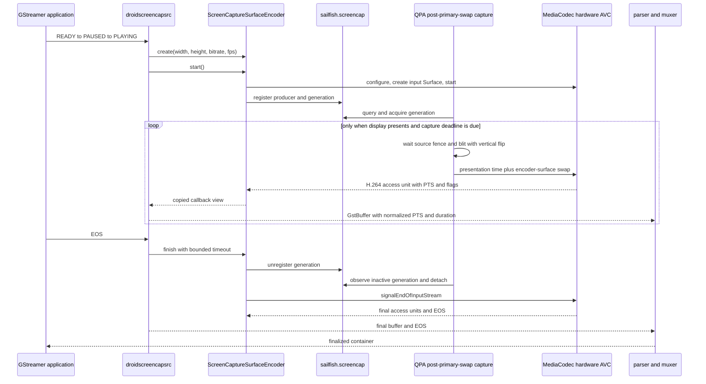

# HWC → H.264 Encoding — Revision 4: GStreamer Integration and Timestamp-Preserving Container Output

**Date:** 2026-09-21  
**Status:** Plan ready. Gates 0–3 are passed. Gate 4 implementation has not started.  
**Basis:** `wiki/hwc-h264-encoding-revision3.1.md` and `wiki/hwc-h264-exec3.1.md`  
**Scope:** Refactor `droidscreencapsrc` to use the proven MediaCodec input-Surface encoder, preserve sparse MediaCodec presentation timestamps in GStreamer/container output, and make EOS, restart, and overload behavior bounded.

## 1. Decision

The Gate 4 direction already existed in outline form in Revision 3 and Revision 3.1:

- replace the rejected raw `ScreenCaptureMediaSource`/BufferQueue encoder path in `droidscreencapsrc` with `ScreenCaptureSurfaceEncoder`;
- retain a bounded output queue, flush-before-join behavior, restart cleanup, and keyframe-aware overload handling;
- continue to expose `video/x-h264,stream-format=byte-stream,alignment=au`;
- validate through a timestamp-aware container rather than a raw `.h264` file.

That outline is correct, but it is not sufficient as an implementation plan. The current tree still has several Gate 4 blockers:

1. `gst-droid/gst/droidscreencapsrc/gstdroidscreencapsrc.c` still creates the legacy raw capture consumer and `ScreenCaptureEncoder`.
2. `screen_capture_surface_encoder.h` is not installed by the droidmedia development package, and `droidmedia/hybris.c` has no wrappers for its C API. `gst-droid` therefore cannot consume the proven Surface encoder through the normal Sailfish/libhybris boundary yet.
3. The Surface callback exposes raw MediaCodec flags, while the old GStreamer element expects semantic `sync` and `codec_config` fields.
4. MediaCodec PTS values are absolute monotonic microseconds from QPA. They must be converted to a GStreamer stream timeline while preserving gaps.
5. The current queue limit drops the oldest encoded frame without regard for inter-frame dependencies. This can leave the next output beginning with a P-frame whose references were discarded.
6. `screen_capture_surface_encoder_stop()` unregisters the producer, waits for QPA detach, then stops MediaCodec. It does not call `signalEndOfInputStream()` or drain to codec EOS, so the final access unit and clean container finalization are not guaranteed.
7. No final-sample duration is carried. This matters when the screen is idle because Gate 3 intentionally submits no duplicate frames.
8. The current element does not define a complete graceful-EOS path distinct from an immediate flush/state teardown.
9. The Surface encoder requires fixed dimensions before registration. The current source element has no Surface-path width/height configuration.

Gate 4 must correct those integration contracts without changing the proven QPA capture scheduling, source import, pacing, or orientation path.

---

## 2. Architecture retained from Gate 3



The pixel path remains:

```text
QPA/HWC RGBA GraphicBuffer
  -> one GPU EGLImage texture blit
  -> MediaCodec input Surface
  -> hardware AVC encoder
  -> encoded H.264 copied into GstBuffer memory
```

There is no CPU pixel copy. Copying the small encoded access unit into GStreamer-owned memory is expected and is not a fallback to software encoding.

### Invariants

1. Do not restore the raw metadata path, `ScreenCaptureMediaSource`, direct HWC `attachBuffer()`, or CPU pixel-copy capture.
2. Do not add Android framework C++ headers to `gst-droid` or QPA.
3. Keep the QPA private session ABI and post-primary-swap scheduler from Gates 2.3/3 unless device evidence identifies a defect.
4. Keep capture event-driven. Do not force lipstick to render duplicate frames merely to create constant-frame-rate output.
5. Preserve the device-required Gate 3 vertical flip.
6. Do not block the MediaCodec drain callback on downstream GStreamer or storage backpressure.

---

## 3. Public droidmedia Surface-encoder contract

### 3.1 Export the proven API through the existing hybris boundary

Modify:

- `droidmedia/screen_capture_surface_encoder.h`
- `droidmedia/screen_capture_surface_encoder.cpp`
- `droidmedia/hybris.c`
- `droidmedia/meson.build`

Required work:

1. Install `screen_capture_surface_encoder.h` with the other droidmedia development headers.
2. Add `hybris.c` wrappers for create, start, graceful finish/stop, and destroy. The Linux `gst-droid` process must reach the Android implementation by the same dynamic hybris mechanism used by the rest of droidmedia.
3. Keep Android `MediaCodec`, Binder, `sp<>`, producer, and Surface types private to the Android implementation.
4. Treat this as a matched droidmedia runtime/devel API update. Do not deploy a new Linux wrapper/header against an old Android `libdroidmedia.so`.

### 3.2 Replace raw flags with stable semantic output information

The GStreamer caller should not decode private platform flag values. Extend the public frame description with semantic fields, for example:

```c
typedef struct {
    const uint8_t *data;
    size_t size;
    int64_t timestamp_us;
    bool sync;
    bool codec_config;
} ScreenCaptureSurfaceEncodedFrame;
```

The exact ABI shape may retain `flags` for diagnostics, but droidmedia itself must derive at least:

- codec configuration data;
- sync/key frame;
- EOS, delivered through the existing EOS callback rather than as ordinary payload.

The callback data remains valid only for the callback duration. `droidscreencapsrc` must copy encoded bytes before returning.

### 3.3 Add graceful finish distinct from forced stop

Add a bounded graceful operation, for example:

```c
bool screen_capture_surface_encoder_finish(
    ScreenCaptureSurfaceEncoder *encoder, int timeout_ms);
```

Required ordering:

1. atomically mark the encoder as finishing so no second finish/stop races it;
2. unregister the active service generation;
3. retain the existing bounded QPA-detach grace interval;
4. call `MediaCodec::signalEndOfInputStream()` while the output drain thread is still running;
5. drain output until MediaCodec EOS or the explicit timeout;
6. invoke the EOS callback exactly once after all preceding access units have been delivered;
7. stop/join/release codec resources;
8. on timeout or codec error, force stop, wake all waiters, and return failure without hanging.

`screen_capture_surface_encoder_stop()` remains the immediate/flush path. It must be idempotent and bounded. `destroy()` may call forced stop if graceful finish has not completed.

Callbacks must not be invoked while holding a lock that `finish()`, `stop()`, or the GStreamer callback path also needs.

### 3.4 Dimensions

For this gate, add `width` and `height` properties to `droidscreencapsrc` and pass them to `screen_capture_surface_encoder_new()`.

- Defaults may be `0`, meaning “attempt `droid_media_screen_capture_get_dimensions()`.”
- If automatic discovery returns no valid dimensions, fail startup clearly and require explicit properties.
- The first device gate should pass `width=1080 height=2520` explicitly so Gate 4 does not silently depend on the retired raw capture queue having published dimensions.
- QPA already rejects a session whose dimensions do not match its display, so a mismatch must produce an actionable source error rather than an empty recording timeout.

Automatic publication of display geometry from QPA can be a later product-polish change. It must not be mixed into the first GStreamer/PTS proof unless explicit dimensions are unacceptable to the consuming application.

---

## 4. `droidscreencapsrc` refactor

Modify:

- `gst-droid/gst/droidscreencapsrc/gstdroidscreencapsrc.c`
- `gst-droid/gst/droidscreencapsrc/gstdroidscreencapsrc.h`
- build/package metadata only as required by the exported droidmedia API

### 4.1 Remove the legacy raw path from this element

Delete from the element runtime path:

- `droid_media_screen_capture_consumer_new()` retries;
- the `queue` field and queue destruction;
- `screen_capture_encoder_new()` and `ScreenCaptureEncoderCallbacks`;
- `color-format` and `metadata-mode` behavior.

Compatibility properties may remain temporarily as deprecated no-ops only if an existing application demonstrably requires them. Prefer removing them before this element has a stable public release; they describe a path that is rejected on this device.

The element should own only:

- one `ScreenCaptureSurfaceEncoder *` per active run;
- configured width, height, FPS, bitrate, and optional keyframe interval;
- bounded encoded-output state;
- timestamp origin and pending-duration state;
- EOS/error/flushing/running state protected by one documented lock.

### 4.2 Caps

Keep encoded output:

```text
video/x-h264, stream-format=byte-stream, alignment=au
```

Set fixed source caps for the configured session with:

- `width`;
- `height`;
- `framerate=fps/1` as the nominal maximum/encoder configuration rate.

Do not claim that every nominal frame period has an access unit. The actual PTS timeline remains variable/sparse when the display is idle.

Do not invent DTS. Leave it unset unless the encoder API later exposes a valid decode timestamp. `h264parse`/the selected muxer may derive stream details. Do not advertise a fixed profile before output parsing proves it.

### 4.3 Timestamp normalization

QPA calls `eglPresentationTimeANDROID` with `CLOCK_MONOTONIC` nanoseconds. MediaCodec returns the corresponding PTS in microseconds. Preserve it as follows:

1. Ignore codec-config timestamps when selecting the origin.
2. On the first ordinary access unit, store `first_codec_pts_us`.
3. For each ordinary access unit, compute:

```text
GstBuffer PTS = (codec_pts_us - first_codec_pts_us) * 1000
```

4. Reject or fail the session on a regressing ordinary PTS; do not silently clamp it.
5. Use checked arithmetic and reject negative or overflowing conversions.
6. Keep `GST_BUFFER_DTS` unset unless a real DTS exists.

This normalizes the first video sample to zero while preserving every idle gap observed in Gate 3. It avoids exposing an arbitrary system-uptime timestamp to the GStreamer segment.

### 4.4 Buffer duration and the final sample

Use one-access-unit lookahead for ordinary video frames:

- retain the newest ordinary access unit as `pending`;
- when the next ordinary AU arrives, set the prior AU duration to `next_pts - prior_pts`, enqueue the prior AU, and retain the new AU;
- codec-config data is handled separately and does not participate in duration calculation;
- on graceful finish, finalize the pending AU using the monotonic recording-stop time translated through the same timestamp origin;
- require a positive final duration; if stop time is not later than the final PTS, use one nominal frame period and log the fallback.

This preserves long idle periods without encoding duplicates and gives the final container sample a duration extending to recorder stop. The tradeoff is one-frame output latency, which is acceptable for a recording source and must be documented.

A muxer-specific guess at duration is not a substitute for testing this contract. If the selected GStreamer/muxer stack ignores H.264 input buffer duration, retain correct PTS and record that limitation rather than reintroducing duplicate QPA frames.

### 4.5 Codec configuration and keyframe flags

For ordinary frames:

- unset `GST_BUFFER_FLAG_DELTA_UNIT` for sync/key frames;
- set it for non-sync frames.

For codec configuration:

- preserve it as `GST_BUFFER_FLAG_HEADER` data in byte-stream mode for the first integration gate, since `h264parse` is mandatory downstream;
- do not include codec-config buffers in ordinary frame counts, timestamp-origin selection, or duration lookahead;
- retain the latest codec configuration separately so queue overflow cannot permanently discard the only SPS/PPS data.

A later refinement may put parsed codec data in caps, but it is not required before `h264parse` proves the byte-stream path.

---

## 5. Bounded queue and overload policy

The existing queue limit of ten access units is a useful starting bound, but “drop oldest” is not safe for inter-frame video.

### Required policy

1. The MediaCodec callback never blocks waiting for downstream.
2. Codec-config data is retained separately and does not consume the ordinary video queue limit.
3. When the ordinary queue reaches its byte or frame bound:
   - drop all queued ordinary video frames;
   - discard the pending lookahead frame if it can no longer be emitted with a valid dependency chain;
   - enter `waiting_for_keyframe` state;
   - drop incoming non-keyframes until a sync frame arrives;
   - emit retained codec configuration before that sync frame if required by the parser;
   - resume normal queueing from the sync frame.
4. Log one warning per overload episode with dropped-frame and dropped-byte totals, not one warning per frame.
5. Prefer both a frame-count and byte-count bound. Ten 1080x2520 access units are not a deterministic memory bound at high complexity/bitrate.
6. If a portable MediaCodec sync-frame request is added, treat it as an optimization and verify it on-device. The configured one-second I-frame interval remains the fallback recovery bound.

The overload test must prove that the post-drop stream resumes decoding at a keyframe. A bounded queue alone is not sufficient.

---

## 6. Lifecycle and thread model

### 6.1 Start

`GstBaseSrc::start()` must:

1. reset EOS, flushing, error, timestamp, pending-frame, and overload state;
2. validate dimensions, bitrate, and FPS;
3. set fixed encoded caps;
4. create `ScreenCaptureSurfaceEncoder` with Surface callbacks;
5. start it, which starts MediaCodec/drain before publishing the producer;
6. only then mark the element running.

On any failure, destroy every partially created object, clear queued/pending data, and leave the object restartable.

### 6.2 Graceful EOS

Handle application/pipeline EOS as a graceful recording finish:

1. initiate `screen_capture_surface_encoder_finish()` without holding `output_lock`;
2. allow output callbacks to enqueue all final AUs;
3. on encoder EOS, finalize/enqueue the pending AU, mark source EOS, and wake `create()`;
4. `create()` drains queued data, then returns `GST_FLOW_EOS`;
5. downstream `h264parse` and muxer receive EOS and finalize the container.

The implementation must account for how the target GStreamer version delivers EOS to a live `GstBaseSrc` (for example through the element `send_event` path). Verify this with a focused host/source review and then on-device; do not assume `GstBaseSrc::stop()` can still push a final pending buffer after the source task has already been stopped.

### 6.3 Flush and forced stop

On flush/state teardown:

1. under `output_lock`, set `flushing=true`, `running=false`, and wake all waiters;
2. make `create()` return `GST_FLOW_FLUSHING` when no queued buffer should be delivered;
3. release the lock;
4. call the bounded immediate encoder stop/destroy path;
5. reacquire the lock and free queue, pending frame, retained config, and timestamp state;
6. leave the element ready for a later start.

Never call encoder stop/finish while holding `output_lock`, because the encoder drain thread may be inside a callback that needs the same lock.

### 6.4 Error

The droidmedia error callback must:

- store the first error;
- mark the source terminal for that run;
- wake `create()`;
- post one `GST_ELEMENT_ERROR` from a thread-safe path;
- ensure `create()` returns an error rather than waiting forever.

A callback must not destroy the encoder from its own MediaCodec drain thread.

### 6.5 Restart

The same element instance must support at least two complete `PLAYING -> NULL -> PLAYING` or equivalent sessions without restarting lipstick. Every run gets a new service generation and a fresh timestamp origin.

---

## 7. Gated implementation and validation

No later sub-gate passes by inference from an earlier one.

### Gate 4.0 — API and build boundary

Implement/export the Surface encoder API and compile the refactored element.

Checks:

- `screen_capture_surface_encoder.h` is installed by droidmedia-devel;
- the Linux wrapper contains every Surface API symbol used by `gst-droid`;
- `gst-droid` contains no Android framework C++ include or direct MediaCodec/Binder type;
- the legacy raw screen-capture encoder is no longer referenced by `droidscreencapsrc`;
- droidmedia Android target, droidmedia package/devel wrapper, and gst-droid package build cleanly;
- `gst-inspect-1.0 droidscreencapsrc` loads the plugin and shows the intended properties/caps.

**Pass:** clean matched builds, successful plugin load, and no layering regression.

### Gate 4.1 — GStreamer byte-stream output

Run without a muxer first:

```sh
gst-launch-1.0 -e -v \
  droidscreencapsrc width=1080 height=2520 \
      target-bitrate=8000000 fps=30 ! \
  h264parse ! filesink location=/tmp/screen-gate4.1.h264
```

Interact with an asymmetric moving UI, then leave the display visually idle for several seconds, then interact again before EOS.

**Pass:**

- QPA acquires the new generation and submits vertically corrected real content;
- output is non-empty and decodable;
- GStreamer logs show monotonic normalized PTS with a visible idle gap;
- keyframe/config flags are sensible;
- EOS exits without a hang;
- no QPA capture error, circuit breaker, or persistent UI hitch occurs.

Raw H.264 playback speed is not an acceptance criterion because it cannot store sample timestamps.

### Gate 4.2 — Timestamp-preserving Matroska output

```sh
gst-launch-1.0 -e -v \
  droidscreencapsrc width=1080 height=2520 \
      target-bitrate=8000000 fps=30 ! \
  h264parse ! matroskamux ! \
  filesink location=/tmp/screen-gate4.2.mkv
```

Use a test timeline that can be correlated with logs:

1. move/scroll for approximately 3 seconds;
2. leave the screen unchanged for approximately 5 seconds;
3. move/scroll for approximately 3 seconds;
4. leave it unchanged for approximately 2 seconds;
5. send EOS.

Validate with `ffprobe` packet timestamps/durations, decoded representative frames, and normal playback.

**Pass:**

- container duration is close to wall-clock recording duration, including idle intervals;
- packet PTS is monotonic and preserves the approximately five-second idle gap;
- playback holds the preceding frame through the idle interval instead of accelerating across it;
- the final packet has a usable duration extending close to stop/EOS;
- the container closes cleanly and is recognized after repeated playback;
- no duplicate-frame requirement was added to QPA.

### Gate 4.3 — Lifecycle and sequential sessions

Run two complete container recordings from the same lipstick process, preferably also reusing the same application/element instance.

Inject or exercise:

- EOS while the display is idle;
- immediate state teardown/flush without graceful EOS;
- start failure with an incorrect dimension, followed by a corrected successful start;
- recorder process termination, followed by a new recording;
- two successful service generations without restarting lipstick.

**Pass:** no deadlock, stale callback, use-after-free, stale generation, empty second session, or unfinalized graceful container. QPA detaches and reacquires cleanly.

### Gate 4.4 — Slow downstream and keyframe recovery

Introduce bounded downstream delay, for example with an `identity` handoff/sleep test helper or a deliberately slow sink, without blocking the MediaCodec callback directly.

Retain logs showing:

- queue bound reached;
- one overload episode summary;
- discard-until-keyframe behavior;
- first emitted post-overflow ordinary frame is a sync frame;
- parser/decoder resumes without permanent corruption;
- process memory remains bounded;
- QPA/encoder-surface swaps remain bounded and lipstick remains responsive.

**Pass:** bounded memory and recovery at a keyframe. Merely avoiding OOM is not enough if the remaining stream is undecodable.

### Gate 4.5 — Optional MP4/application compatibility

After Matroska passes, test the application-required container. For MP4, use parser conversion rather than changing the source contract, for example:

```sh
gst-launch-1.0 -e -v \
  droidscreencapsrc width=1080 height=2520 \
      target-bitrate=8000000 fps=30 ! \
  h264parse config-interval=-1 ! \
  video/x-h264,stream-format=avc,alignment=au ! \
  qtmux ! filesink location=/tmp/screen-gate4.5.mp4
```

**Pass:** clean EOS/finalization, correct duration and idle gaps, normal seek/playback, and recognition by the target Sailfish application/Gallery if that is a product requirement.

Do not block the first functional Gate 4 pass on MP4 if Matroska correctly proves timestamps and lifecycle.

---

## 8. Build and deployment plan

Gate 4.0 requires new builds; no build is needed merely to review this plan.

### Required after implementation

1. **Android droidmedia target build**
   - builds the updated Android `libdroidmedia.so` containing the Surface API, semantic flags, and graceful finish/EOS implementation;
   - this is not replaced by the Sailfish RPM wrapper build.
2. **Sailfish droidmedia/devel package build**
   - installs the Surface header;
   - builds/installs the updated `hybris.c` wrapper library/API used by Linux clients.
3. **gst-droid package build**
   - builds the refactored `droidscreencapsrc` and plugin.

Deploy those artifacts as a matched set. Record package revisions and verify with `gst-inspect-1.0` before running a pipeline.

### Not expected for the first Gate 4 run

- no QPA rebuild if Gate 4 uses explicit `width`/`height` and does not alter the private capture ABI;
- no `libminisf.so` rebuild if the service/session Binder contract remains unchanged;
- no libhybris EGL platform rebuild;
- no new SELinux policy unless the device logs contain an actual denial. Gate 3 already proved service registration and cross-process producer use.

The Gate 3-proven QPA plugin must remain deployed and configured before lipstick starts:

```text
QPA_HWC_SCREENCAP=1
QPA_HWC_SCREENCAP_SOURCE=1
QPA_HWC_SCREENCAP_FLIP_Y=1
QPA_HWC_SCREENCAP_FRAME_LIMIT=0
```

Do not set the test-bars mode. Do not set an FPS override for the normal Gate 4 run; QPA must use the recorder-published FPS.

---

## 9. Evidence to retain from each device run

Provide or archive:

1. exact droidmedia Android artifact, droidmedia wrapper/devel package, gst-droid package, QPA plugin, and libhybris EGL platform revisions;
2. `gst-inspect-1.0 droidscreencapsrc` output;
3. complete pipeline stdout/stderr with `-v` and focused `GST_DEBUG` for `droidscreencapsrc`, `h264parse`, and the muxer;
4. lipstick/QPA journal covering registration, acquisition, frame submissions, detach, and any EGL/GL/circuit-breaker error;
5. droidmedia logs covering component selection, registration generation, output PTS/flags, unregister, input EOS, output EOS, timeout, and stop;
6. `ffprobe -show_streams -show_format` output;
7. `ffprobe -show_packets` output around the deliberate idle gap and final packet;
8. decoded frames before and after the idle interval;
9. wall-clock run duration versus container duration;
10. UI responsiveness, process memory during overload, and whether lipstick stayed in the same process;
11. both outputs and logs for sequential-session tests.

A pipeline that exits successfully but emits an empty file, collapses idle gaps, hangs on EOS, or produces an unfinalized container does not pass.

---

## 10. Explicit non-solutions

- Do not route `droidscreencapsrc` back through `ScreenCaptureMediaSource` or `screen_capture_encoder_new()`.
- Do not expose Android framework C++ objects through the public GStreamer-facing API.
- Do not assign absolute system-uptime MediaCodec PTS directly to GStreamer buffers.
- Do not rewrite sparse PTS into `frame_number / fps`; that recreates the accelerated-idle bug.
- Do not force duplicate QPA frames to make the stream constant-rate. A downstream `videorate`/transcode policy may do that when explicitly requested.
- Do not drop arbitrary oldest H.264 frames and continue from a dependent P-frame.
- Do not block the MediaCodec drain callback on a full GStreamer queue.
- Do not stop/join the encoder while holding the GStreamer output mutex.
- Do not rely on raw `.h264` playback to validate timing or application compatibility.
- Do not claim clean container output until EOS reaches and finalizes the muxer.

---

## 11. Completion criterion

Gate 4 is complete when a GStreamer pipeline records real, correctly oriented Sailfish screen content using the proven hardware AVC Surface path into a timestamp-aware container, with all of the following demonstrated on-device:

- monotonic PTS preserving deliberate idle gaps;
- container duration matching wall-clock recording duration;
- a valid final sample and clean muxer EOS;
- bounded, keyframe-safe output buffering;
- clean flush, stop, failure, and sequential restart behavior;
- no software video encoding or CPU pixel-copy fallback;
- no persistent UI hitch, capture circuit breaker, or process restart.

Only after that should product polish decide automatic dimension discovery, permanent QPA enablement/configuration, audio muxing, default container choice, and application UI integration.
